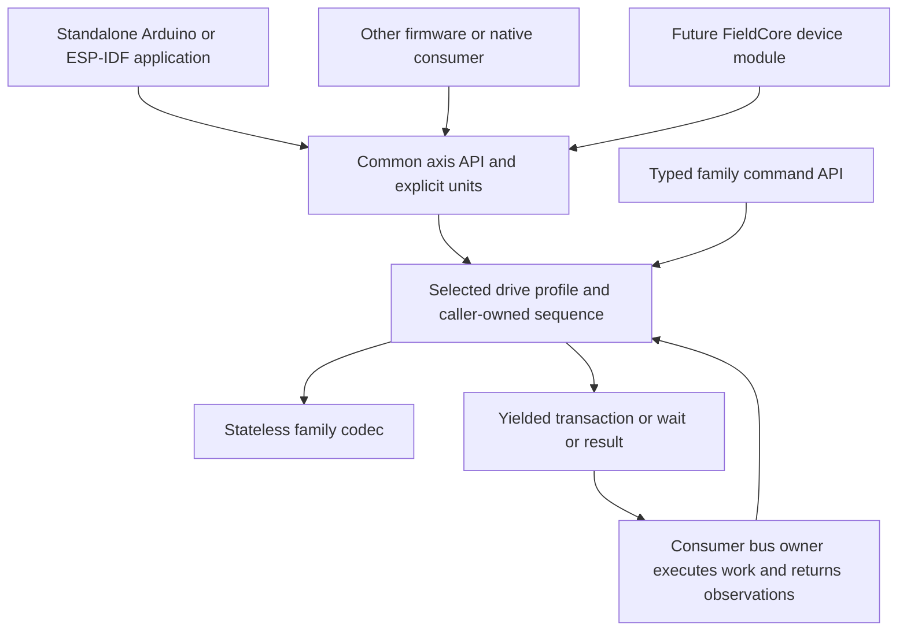

# MotorControl-RS architecture

This is the accepted design baseline for a general, framework-independent
serial motion library. ESS23-RS is its first implementation target. A common
axis interface provides the same motion vocabulary across selected drive
profiles, while typed profile extensions expose each drive's complete
documented command set. Arduino, native ESP-IDF, desktop/native consumers and
FieldCore are separate applications of the same library.

The reference application demonstrates an RS485 transaction workflow, not a
FieldCore product. Its future motor device is not defined here. MCU-specific
UART/DE capture and memory choices stay in example adapters; the application
supplies board pins explicitly. Other platforms can use the same core and
portable runner with their own callbacks. Other manufacturers add profiles
when real hardware and a concrete need justify them.

External drive I/O is optional for operations that do not depend on it.
Profiles must expose their documented disabled/no-function assignments.
Unconnected wiring is separate from a disabled assignment; neither may be
inferred from an inactive signal. See the [profile I/O contract](profile_contract.md).

Implemented blocks supply pure units, an ESS register catalogue and checked
wire codecs with a minimal model-register probe. An example-owned RTU runner
is implemented and tested with a native fake adapter; see [runner.md](runner.md).
The [ESP32-S3 polling adapter and probe CLI](esp32_probe.md) now have native and bench
evidence, with external timing qualification still open. Motion preparation,
discovery orchestration, the full CLI and FieldCore adapters remain contracts
for later blocks. See the root
README for current callable APIs and build commands. No motor behavior has
been qualified beyond the recorded model-register probes.
The [application bus reference](bus_owner.md) adds tested FIFO admission,
immutable deadlines and reserved retained results. Fair scheduling/cancellation
and console integration remain release prompts 02 and 03.
The [current architecture report](architecture_report.md) maps existing files
and dependencies, walks through a transaction and records the latest source
review of standalone and FieldCore integration. The planned layout below is
a design guide, not a list of implemented files.

The [axis contract](axis_contract.md) defines common operations and units;
the [profile contract](profile_contract.md) defines native command coverage;
the [CLI contract](cli_contract.md) maps both into the standalone console.
The [discovery contract](discovery_contract.md) defines minimal non-changing
probes and bounded per-profile/manufacturer scans. Work and remaining questions
are tracked in [the backlog](backlog.md); available test hardware is recorded
in [the bench note](hardware_bench.md).
The [ecosystem review](reference/02_ecosystem_review.md) records sibling
conventions, and the [manufacturer review](reference/03_multi_vendor_feasibility.md)
supports the chosen abstraction. Device facts and unresolved register
questions remain in the [implementation reference](reference/01_implementation_reference.md).

## Scope and compatibility

Use `MotorControl-RS` as the package name, `MotorControlRS` as the namespace
and CMake identity, and `MotorControlRS/MotorControlRS.h` as the entry header.
The recommended repository/folder name is `MotorControl-RS`; a checkout rename
does not change these identities. See [rename steps](repository_rename.md).
The ESS family lives under `MotorControlRS::ESS_RS`.
Consumers must update old includes/names; no legacy alias layer is supplied.

The accepted CANopen direction is a separate future library, initially for the
verified Lichuan CL86-C subset. Both libraries follow the documented axis
semantics, while retaining independent protocol engines, native APIs and
application-owned transports. Extract shared units/types when the second
implementation demonstrates reuse; do not add a universal transport engine
or CANopen dependency here. See the [decision and evidence](reference/07_canopen_feasibility.md).
The serial-library name is accepted independently of the future CANopen package.

Implement ESS23-RS20 first and account for ESS23-RS10 using their shared
hardware manual. Design the common contracts against Leadshine iEM-RS as the
contrasting family before freezing the API. Leadshine is a documented design
comparison, not an implemented or qualified profile. Other manufacturers in
the research report remain candidates.

A supported profile identifies family/model, protocol and firmware scope.
Full native command coverage means the documented surface for that scope,
not all products from a manufacturer. Treat identity as observed data and
track protocol evidence, implementation coverage and hardware qualification
separately. No arbitrary Modbus register map establishes motion compatibility.

Use free functions, fixed-size value types, `camelCase` functions/fields,
`PascalCase` types and `CAPS_CASE` constants and enum values. Keep profile
selection finite and explicit, using static dispatch or a small constant
function table. Build-time selection can omit unused profiles; no dynamic
plugin loader or heap-allocated driver hierarchy is required.

The initial scope is drive-managed position, velocity, homing and related
commands. Unit-oriented positioning in steps/counts, turns, degrees, radians
and linear travel is part of the public axis design, not a CLI convenience.
Advanced features stay accessible through typed native extensions even when
they cannot map to the common interface. Synchronized multi-axis trajectories
and a host servo loop are separate future scopes.

## Three reusable layers and their consumers

1. The common axis layer validates intent, resolves explicit unit conversion
   and capability requirements, and projects validated observations with
   explicit quality and qualification. Common
   motion requests are independent of manufacturer register addresses.
2. Drive profiles define exact wire values, stateless codecs, command
   sequences, completion evidence and native extensions. A reusable finite
   sequencer may advance caller-owned operation state from supplied events
   and time. It yields transaction/wait/result descriptions without I/O.
3. Application integration owns the transport and executes yielded work.
   Standalone Arduino and native ESP-IDF examples, other firmware, native
   tests and FieldCore can each supply their own integration.

The shared sequencer is a deliberate addition above the sibling-style codec.
It prevents each consumer from reimplementing device handshakes. It does not
schedule itself, retry autonomously or choose machine workflows. Applications
still decide which motions to perform and own interlocks, scheduling and
recovery policy. Consumers may also use a profile codec directly.

## Ownership

| Concern | Reusable library | Standalone or other application | Future FieldCore integration |
| --- | --- | --- | --- |
| Axis intent, units, capabilities | Pure validation/conversion and common value types | Supplies scale, origin and limits | Module translates product settings |
| Registers, framing, checksums and validation | Stateless per-profile codecs | Calls profile API | Device module calls profile API |
| Device command sequence and completion evidence | Bounded advancement of caller-owned operation state | Owns context, feeds results/time, schedules work | Module owns context and uses existing owner |
| TX/RX storage | Borrows during a call; retains no frame pointers | Owns fixed buffers | Bus owner owns transaction/receive storage |
| UART, pins, DE/RE, TX drain and receive framing | No ownership | Application transport | Existing RS485 owner/backend |
| Address, serial tuple, word order, scale and selected profile | Explicit immutable operation inputs | Owns configuration | Product settings and module |
| Polling, timeouts, retries and recovery | Describes deadlines/replay constraints; makes no autonomous attempts | Executes application policy | Owner and module under product policy |
| Last valid readings, freshness, health and counters | Supplies decoded observations and pure projections | Owns cache, timestamps and health policy | Module and health projection |
| Logs, CLI, persistence and discovery | No services or side effects | Application features | Existing application services |

The consumers are alternatives, not separate masters on the same UART.
Exactly one application bus owner arbitrates a physical port. The stateless
codec has no lifecycle, background task or transaction-performing `read` or
`moveTo`. A builder only writes bytes; the common API and sequencer also
produce data and transitions, never transport side effects.

All work is bounded by explicit frame, command and operation-state limits.
No heap, Arduino/ESP-IDF headers, GPIO, clock reads, sleeping, logging,
FreeRTOS objects or hidden mutable globals enter `include/` or `src/`.
Time is an explicit input where needed. Contexts contain bounded copied
values, not borrowed frame or transient request pointers. Independent
contexts are reentrant; applications synchronize shared buffers and contexts.

## Planned file responsibilities

The units, status, entry/version headers, ESS catalogue and codec already exist.
The following layout also includes planned files; it is not a request to
create stubs. See the root README for the current callable surface.

| Current or planned path | Responsibility |
| --- | --- |
| `include/MotorControlRS/MotorControlRS.h` | Common public entry point, without forcing all profile headers into every consumer |
| `include/MotorControlRS/Axis.h` | Common command intent, capabilities and observations |
| `include/MotorControlRS/Units.h` | Explicit quantities, coordinate configuration and checked conversion |
| `include/MotorControlRS/Profiles.h` | Profile identity and finite dispatch contracts |
| `include/MotorControlRS/Sequence.h` | Bounded caller-owned operation state, supplied events and yielded work |
| `include/MotorControlRS/Status.h` | Shared validation result and parser error categories |
| `include/MotorControlRS/profiles/ess_rs/Codec.h` | Implemented bounded builders, validators, checked parsers, probe and word conversion |
| `src/rtu/Frame.h` | Private byte packing, CRC and frame helpers without device policy |
| `examples/common/RtuRunner.h`, `RtuRunner.cpp` | Implemented bounded application transaction runner with caller-owned buffers/traces and native fake tests |
| `include/MotorControlRS/profiles/ess_rs/Commands.h` | Full typed ESS command surface and sequence descriptions |
| `include/MotorControlRS/profiles/ess_rs/Registers.h` | Verified ESS register definitions and value enums |
| `include/MotorControlRS/profiles/ess_rs/Types.h` | Exact ESS values, raw flags, alarms and word order |
| `include/MotorControlRS/Version.h` | Implemented generated version constants from package metadata |
| `src/axis/`, `src/units/`, `src/protocol/` | Common validation, conversion and proven reusable framing helpers |
| `src/profiles/ess_rs/` | ESS codec, native command mapping and bounded sequencing |
| `examples/01_basic_bringup_cli/` | Arduino entry point, example transport and board integration |
| `examples/common/` | Board pins, platform adapters, shared console inventory/dispatch and application support |
| `examples/espidf_basic/` | First-class native ESP-IDF consumer of the same core and console semantics |
| `test/` | Native codec, units, sequence and consumer-contract tests when behavior exists |
| `docs/IDF_PORT.md` | Framework-neutral consumption and native IDF instructions when implemented |

The first implementation uses `include/MotorControlRS/` and `src/Units.cpp`,
with the ESS catalogue under `profiles/ess_rs/`. The old empty ESS-only header
directory has been removed. Do not create empty profile APIs or a Leadshine
implementation merely to mirror the design table. Split files only when useful.

Every public header must compile alone and include only public or standard
headers. Doxygen must state units, input limits, buffer lifetimes, failures,
output mutation and absence of I/O. Keep public structures small; do not copy
sensor channel arrays, historical compatibility aliases or unused status
members from siblings.

## Codec function vocabulary and buffer contract

The raw codec families below are implemented in `profiles/ess_rs/Codec.h`;
typed identity/status and motion helpers remain planned. The header records
the callable signatures and validation precedence.
Common axis names are specified separately in the [axis contract](axis_contract.md).
Non-Modbus profiles retain suitable native framing and address types; these
register-oriented helpers are not mandatory public operations for every drive.

| Family | Intended names and behavior |
| --- | --- |
| Request validation | `validateReadRegistersRequest`, `validateWriteSingleRegisterRequest`, `validateWriteMultipleRegistersRequest`; return diagnostic `Status` |
| Generic builders | `buildReadRegisters`, `buildWriteSingleRegister`, `buildWriteMultipleRegisters`; return frame length or zero |
| Full response validation | `validateReadResponseExpected` with expected address/count and structured failure reason |
| Checked generic parsing | `parseRegister`, `parseRegisters`, `parseWriteSingleRegister`, `parseWriteMultipleRegisters` |
| Typed reads | `buildReadIdentity` / `parseIdentity`, `buildReadMotorStatus` / `parseMotorStatus` |
| Pure conversions | `encode...Register`, `decode...Register`, explicit `WordOrder` for register pairs |
| Domain checks | `isValidAddress`, `isReadRangeValid`; use only the reviewed ESS map |
| Sizing and CRC | `expectedReadRegistersLen`, `expectedWriteSingleRegisterLen`, `expectedWriteMultipleRegistersLen`, `calcCrc16` |

Use the agreed generic names directly and simple private helper names such as
`readWord`, `writeHeader` and `checkReply`. All ESS frame parsers are checked;
there is no need for an unchecked compatibility variant or a second identical
`Checked` alias in a fresh API. A payload decoder is distinctly named
`decode...` and operates on an already validated register block.

Builders accept the target address, request values, writable byte buffer and
capacity. Validators and builders share validation logic. Validate the whole
request before writing: on failure return zero and preserve the buffer. A
successful build reports exactly how many bytes are valid. Never transmit a
zero-length result.

Parsers accept immutable frame bytes and length, expected request information,
and caller-owned output/capacity. All payload outputs, including scalar values,
remain unchanged on error. An explicit output-count parameter resets to zero
on entry and is published only on success; diagnostic-reason outputs may be
updated on failure. Decode into bounded temporary storage before publishing.
Document byte capacities versus register counts. Reject unsupported overlap
between input and output buffers rather than relying on accidental aliasing.

Reject unsupported frame lengths before CRC iteration or payload indexing.
Check counts and register endpoints before overflow-safe size arithmetic;
an arbitrary caller length must not turn bounded validation into an unbounded
scan. Size helpers distinguish request and response sizes in their comments.

No codec function retains a caller pointer after return. A consumer which queues
work must own or copy its frame/request until completion. Timestamps and last
valid cache updates happen in the consumer after successful parsing.

## Status and diagnostics

Adopt the common `Status { Err code; int32_t detail; const char* msg; }` shape,
`isOk()`, free `Ok()`, `errToString()` and explicit Boolean conversion. Every
message is a static string. Do not require consumers to parse messages or
assume enum numeric compatibility with another library.

Use SHZK-style codec categories: `OK`, `INVALID_CONFIG`, `CRC_ERROR`,
`FRAME_ERROR`, `EXCEPTION`, `ILLEGAL_VALUE`, `UNSUPPORTED`. An optional
structured response-error output distinguishes address, function, length,
byte count, CRC and write-echo mismatch without reparsing the frame in an
application. Define the precedence of validation errors in tests.

`detail` carries the raw device exception byte for `EXCEPTION`. ESS vendor
exception descriptions conflict with conventional Modbus labels; preserve
unknown codes and identify the label source. Do not copy a sibling's generic
exception text and present it as confirmed ESS behavior.

Keep four separate meanings of status:

| Result or state | Owner and meaning |
| --- | --- |
| Codec `Status` | Whether this frame/value is valid for the expected operation |
| Motor status/alarm | Successfully decoded device data, including raw status word and alarm code |
| Transaction/workflow result | Application admission/transport facts plus profile sequence progress, completion evidence and execution uncertainty in caller-owned state |
| Health/presence/freshness | Application judgement over observations and elapsed time |

A valid alarm-bearing reply is codec success and communication evidence. It
can still make the motor unusable for a requested movement. A CRC failure
cannot publish a new position or alarm. No reply gives no evidence that the
motor is stopped. Preserve the last valid observation with its age and the
latest attempt error separately for each independently refreshed data block.
A successful identity read cannot refresh an older position or alarm value.

Profiles classify read side effects as well as write effects. A read-to-clear
completion word or event FIFO has one declared consumer; background polling,
diagnostics and native getters must not independently consume sequence
evidence. Cached queries stay passive. Explicit consuming reads participate
in operation coordination and retain the consumed observation for callers.

For the standalone example, use application health labels
`unknown`, `initializing`, `ok`, `degraded`, `fault`,
`disabled`. `disabled` means monitoring/module selection is disabled, not
that the motor windings are released. Track motor enabled/released state
separately. Thresholds for stale data and consecutive failures are explicit
application configuration, not copied sensor constants. Initial state is
unknown; a zero-initialized status word is never evidence of readiness.

Counters belong to the transport/application: submissions, successful
responses, no-byte timeouts, partial frames, CRC/shape errors, exceptions,
retries, recoveries and uncertain writes. Polling statistics do not replace
the retained result of an explicit command. Resetting counters does not clear
motor alarms, cached safety-relevant observations or an uncertain operation.

## ESS protocol decisions and unresolved limits

Use FC03, FC06 and FC10 only where the ESS pages support the operation. The
documented FC03 limit is 16 registers (function PDF p7). A normal maximum
FC03 response is consequently 37 bytes. FC06 requests/replies and FC10
acknowledgements are 8 bytes; an exception reply is 5 bytes. FC10 requests
need `9 + 2 * count` bytes, including 13 bytes for the documented two-register
example (p8). These frame sizes do not establish a device FC10 count limit.

The general ESS write limit is unresolved. The implementation admits four
documented FC10 start/count windows: 0x0024/2 (p8), 0x0021/5 (p16), 0x001D/3
(p18) and 0x0031/6 (p20). These are supported windows, not a device maximum.
Other windows await evidence. FC06 rejects paired
halves as a library policy; the manual does not explicitly prohibit them. Do not
split a 32-bit target into unrelated FC06 writes as a capacity workaround.
Do not assume a multi-register write is internally atomic without evidence.

Access checks use a compact private table generated from the same JSON ledger
as the descriptive catalogue. Basic codec use does not require the catalogue's
strings. The generator accounts for all documented words and explicit gaps;
missing documentation does not authorize probing arbitrary register holes.

The [timing audit](reference/09_timing_and_gap_audit.md) distinguishes vendor
facts, RTU standard timing and calculated wire times. The application owns
those timers. ESS supplies no documented maximum response or save-completion
time; do not turn host defaults into device guarantees.

Use explicit unicast addresses 1-247 for the initial supported surface.
Broadcast motion and extended vendor address values are deferred. Never
borrow a sensor's default address. Device serial settings and host settings
are distinct; documented ESS defaults are commissioning hints, not detected
facts. Word order must be read/selected explicitly, not guessed from plausible
position values. The public common API includes turns/degrees and other
engineering units, but an ESS operation using them is admissible only when
its signedness, drive scale and configured axis conversion are established.
Unresolved conversion returns a clear pre-transmission failure. Preserve raw
integer access without claiming those integers are already physical units.

Validate expected slave, function, exact frame length, exact byte count, CRC,
and write echoes before publishing results. FC06 must echo register and value;
FC10 must echo start register and quantity. Validate the exception function
against the expected function as well as its exact five-byte frame and CRC.
Reject trailing data and truncation. The transport must finish framing before
calling the codec; passing only a matching prefix is not exact validation.

FC03 does not echo the requested start register. The owner associates the
response with its one in-flight request and handles late replies, RTU gaps
and receive boundaries. The codec cannot invent transaction IDs or prove
that same-shaped delayed data belongs to a new request.

Read identity and telemetry from documented contiguous windows. Do not read
through undefined gaps just to reduce transactions. Retain raw flags and
unknown bits, and avoid claiming a snapshot assembled from separate reads is
atomic. In particular, the status enable bit has inverted semantics in the
ESS table: bit 4 clear means enabled, set means released (function PDF p68).

The implemented `buildProbe`/`parseProbe` path reads one model word at 0x0000
(p68): eight request bytes, seven normal reply bytes. Unknown model codes stay
raw, and parser success is not confirmed identity. Generic read/write codecs
check raw access and frame shape, not typed value ranges or motion prerequisites.
Pure signed word helpers declare two's complement without resolving the
catalogue's field-specific signedness questions. The larger common
`prepareProbe`/discovery API remains unimplemented.

The [serial comparison](reference/08_serial_protocol_review.md) demonstrates
why limits, read effects, representation and exception meaning stay in each
profile. The private `src/rtu/Frame.h` shares mechanics only; strict ESS reply
checks are not relaxed for other manufacturers' extensions.

## Explicit native commands and shared sequences

Later typed builders should make `buildEnable`, `buildRelease`, `buildStop`,
`buildEmergencyStop`, `buildStartPosition`, `buildStartSpeed`, `buildStartHoming`,
`buildClearAlarm`, `buildClearPosition`, `buildSaveParameters` and
`buildRestoreFactoryParameters` distinct operations, subject to the vendor
review. These names describe frame construction only. Do not introduce a
generic reboot/reset command unless the ESS documentation establishes one.

These initial names do not bound the native API. The
[profile contract](profile_contract.md) requires complete coverage of every
documented command and register for a supported ESS model/firmware scope,
including tuning, I/O, segment configuration and persistence. Unresolved
vendor fields stay explicit gaps; a generic write-register function does not
count as complete typed support.

Reusable profile sequences describe parameter writes, readback, start,
status polling and completion; the application owns their context and
execution. It supplies deadlines/time, interlocks, limits and operator intent.
If a prerequisite write/readback fails or is uncertain, the sequence must not
yield a start trigger. Retain partial-configuration evidence and require
reconciliation before continuing. Direct native commands pass the same
validation, arbitration and uncertainty handling as common axis commands.

Common positioning, speed and coordinate conversion are public API features,
not code hidden inside the example console. Typed native extensions preserve
family features that have no common equivalent. A profile distinguishes
unsupported device capability, unresolved mapping, missing implementation
and absent qualification. None may be silently treated as a successful move.

Arrival/homing flags must be interpreted in the context of the submitted
operation and fresh observations; an old completion bit is not proof a new
move completed. Saving/restoring requires the documented stopped-state
precondition (function PDF p26); an acknowledgement alone does not prove the
firmware applied a command it may ignore.

Track command admission, transmission, validated acknowledgement, and observed
completion separately. A post-transmit timeout leaves execution unknown.
Do not automatically replay relative moves, homing, enable, save or reset
operations using a sensor retry loop. Only explicitly classified operations
may be retried under application policy. Reconnection must not replay motion.

Cancelling a queued request can prevent transmission. Cancelling a sent
request stops local waiting; it does not stop the motor. Stopping needs its
own explicit transaction and observation. Before admitting another transfer,
the transport must settle queued TX, direction control and receive framing;
cancellation cannot bypass those interlocks. A software emergency-stop command
still depends on bus access and a responding drive. Application bus scheduling
must account for urgent stop requests and bound time spent on other devices;
the codec cannot guarantee a stop latency. Stop can supersede an active move,
homing, velocity or native operation and must not be rejected solely because
that operation is busy. Retain both the interrupted operation's evidence and
the stop's result. An in-flight transaction still needs bounded settlement.

Profiles yield service deadlines for required handshakes and periodic refresh
commands. The bus owner admits only work whose timing it can support, reports
missed deadlines, and reserves capacity for stop handling. A timeout or missed
refresh does not prove that an unreachable drive physically stopped. Device
command queues require an explicit retain/flush policy on stop.

## Standalone transport and example boundary

The standalone console and all reusable code must run without FieldCore
headers/services. Native ESP-IDF is a first-class consumer, independent of
Arduino. No Arduino compatibility layer is required to use the public API.
Follow the peers' fixed-buffer cooperative example design: one transport owner,
bounded RX/console work per iteration, wrap-safe deadlines, TX-drain-aware
DE release, documented DE/RE polarity, and explicit idle-only recovery/flush.
Pins, UART instance, host defaults and feature switches live in
`examples/common/`, never in codec constants. Common console semantics may be
shared there while platform I/O stays in separate adapters. With equivalent
build features and profile coverage, Arduino and ESP-IDF expose the same
commands, units and result semantics. Any deliberate feature omission must
be advertised by capabilities/help, not implied by framework choice.

Audit any copied transport before use. VibWire's helper is restricted to FC04
reads. Both request capacity and completion logic must handle ESS read/write
frames and short exceptions. Local echo policy must follow the adapter
topology: FC06 acknowledgements are byte-identical to requests, so stripping
all matching received frames loses valid acknowledgements; accepting local
echo as an acknowledgement can falsely report success.

Startup configures the host and offers explicit non-changing probes and
identity/status checks. Applications own bounded discovery using profile
metadata and prepared queries. Manufacturer grouping does not supply a
universal detection command; ambiguous matches and unsupported probes stay
explicit. A successful probe does not refresh position, alarms or readiness.
Startup performs no automatic enable, movement, alarm clear, homing, save, restore
or device communication change. Persistence, if added, stores explicitly
selected host settings only and never replays commands after boot.

Changing profile, target address, host serial tuple, scale, origin or word order
invalidates the relevant identity, decoding and readiness assumptions. Retain
historical observations and uncertain command results under their original
target/tuple and decoding context; never reinterpret old words using a new
word order or make another selected motor inherit an old command result.

## FieldCore integration boundary

A later FieldCore-owned motor device module should call the public axis/profile
API and implement that repository's binding contract. `Rs485Task` remains the
only physical bus owner. Status snapshots are passive, and borrowed RX bytes
are consumed within the observation callback. Device wait periods release
the bus for other modules. The library has no FieldCore dependency, service
locator, task abstraction, health enum requirement or product settings type.
FieldCore-specific naming and types are translated in its adapter. General
library behavior and public API coverage must not be limited by its current
measurement contracts or frame capacities.

Current FieldCore is not ready for drop-in motor control. The
[review](reference/02_ecosystem_review.md#fieldcore-integration-gaps) identifies
the concrete work: FC06 echo handling, FC10 TX capacity, five-byte exception
completion, serial formats, typed control requests/results, integer precision,
retry policy and stop scheduling. Do not tunnel motion through `Measure` or
reuse module `setEnabled` as drive enable. Integrate through the existing
product composition, settings, CLI routing and health mechanisms when that
work is requested.

## Implementation stages and verification

1. Completed foundation: pure units, the ESS register catalogue, native tests,
   package/build metadata and the offline ESP32-S3 preview. Metadata coverage is
   distinct from operational command coverage and hardware qualification.
2. Completed codec block: bounded ESS FC03/FC06 and four reviewed FC10 windows,
   checked responses, raw exceptions, word helpers, minimal probe and native
   tests. General FC10 limits and typed field/motion ambiguities remain open.
   Wire support does not establish permission to write every register.
3. The runner, ESP32-S3 adapter and probe CLI have native tests and bench evidence.
   Finish external timing qualification and identity/settings/state reads;
   preserve explicit raw-model uncertainty and the observed turnaround exception.
4. Implement checked target preparation, ESS motion/stop sequencing and the
   corresponding common/native commands in small tested blocks. Challenge
   signatures against the documented Leadshine contrast. Qualify stop handling
   alongside the first small moves, then velocity and supported homing.
5. Expand full native ESS coverage and standalone Arduino S2/S3 and native
   ESP-IDF consumers with equivalent semantics for equivalent features. Keep
   protocol/unit/sequence tests runnable without either framework. Record
   model/firmware-specific qualification and obtain contrasting hardware
   before advertising another supported profile.
6. Integrate into FieldCore when requested, through its own contract/owner
   changes and tests. Standalone functionality does not depend on this step.

The initial pure units/catalogue tests use CMake/CTest standalone executables
with assertions enabled in Release, without a test-framework dependency.
As behavior grows, add native protocol/sequence tests, self-contained-header compilation,
framework-boundary checks, example command-contract checks, Arduino S2/S3
builds, native IDF builds and a clean package consumer. VTN/VibWire provide
CMake/IDF packaging examples; package claims must match tested consumption.
Keep downloaded PDFs, software and CAD out of the distributed source package
and do not relicense them. `library.json` is the version authority;
`scripts/generate_version.py` maintains the public version header. Record
implemented changes and qualification limits in the changelog.

Tests must establish independent golden frames/CRCs, count/capacity boundaries,
invalid pointers/arguments, exact normal and exception shapes, wrong slave/FC,
bad echoes, both word orders, signed boundaries, raw unknown flags/exceptions,
and unchanged codec/value/preparation payload outputs on validation failure.
Sequence tests separately verify that valid timeout/failure events update
caller-owned state and retain the failed or uncertain operation outcome;
invalid event envelopes/correlation leave the context unchanged.
Add unit conversion, quantization,
overflow, scale revision, wrapped-angle direction/tie, reference validity,
capability rejection and sequence interruption cases from the axis/profile
contracts. Verify unsupported or unresolved requests yield no transaction.
Do not use the same encoder as the sole oracle for its decoder.
Add transport tests for partial/local echo,
no-echo FC06 acknowledgement, late/overlong frames, short exceptions, deadline
wrap, DE failure and uncertain writes. CLI tests must prove diagnostic commands
do not emit writes and startup/recovery do not replay motor commands.

Native/build success is distinct from hardware qualification. The offline ESP32-S3
Arduino preview has compiled; motor communication/motion, native ESP-IDF
firmware and S2 builds remain unverified. See [recorded checks](verification.md).
