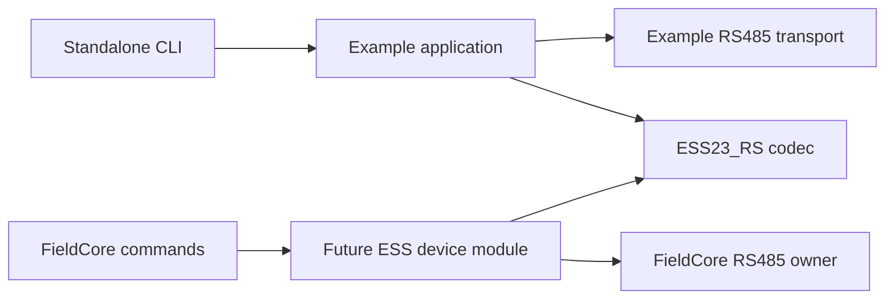

# ESS23-RS architecture

This is the design baseline for a standalone ESS23-RS codec and its future
bring-up applications. It follows the current SHZK-PT, VTN4xx and VibWire-108
ownership model and accommodates later FieldCore-node integration. It does
not describe implemented APIs or qualified motor behavior. No library code,
build metadata, example firmware or FieldCore adapter exists here yet.

The [ecosystem review](reference/02_ecosystem_review.md) records the source
evidence and differences between the peers. The [CLI contract](cli_contract.md)
defines the example behavior. Device facts and unresolved register questions
remain in the [implementation reference](reference/01_implementation_reference.md).

## Scope and compatibility

Start with ESS23-RS20 and account for ESS23-RS10 using their shared hardware
manual. Treat model and firmware identity as observed data. Do not claim
support for all STEPPERONLINE motors, the DM-PR family, or arbitrary Modbus
drives. Another model becomes supported only after its register map, command
semantics and tests establish compatibility.

Keep one library, namespace `ESS23_RS`, and eventual public entry header
`ESS23_RS/ESS23_RS.h`. Use free functions, fixed-size value types, `camelCase`
functions/fields, `PascalCase` types, and `CAPS_CASE` constants and enum values.
FieldCore's `kPascalCase` constants and application types stay in FieldCore.
Do not introduce a generic motor plugin framework for hypothetical models.

## Ownership

| Concern | Codec | Standalone example | Future FieldCore integration |
| --- | --- | --- | --- |
| Register definitions, value encoding, CRC, frame validation | Owns | Calls codec | Device module calls codec |
| TX/RX storage | Borrows during each call | Owns fixed buffers | Bus owner owns transaction/receive storage |
| UART, pins, DE/RE, TX drain, RTU framing and silence | No ownership | Example transport | Existing RS485 owner/backend |
| Address, serial tuple, word order and selected model | Explicit arguments | Owns configuration | Product settings and device module |
| Polling, timeouts, retries and recovery | No ownership | Example application | Owner and device module under application policy |
| Motion sequence and completion tracking | Encodes/decodes one operation | Application workflow | Typed motor command/module workflow |
| Last valid readings, freshness, health and counters | No runtime state | Example application | Device module and health projection |
| Logs, CLI, persistence and discovery | No ownership | Example-only features | Existing application services |

The diagram shows two alternative consumers. They must not independently
drive the same UART. The reusable codec has no `begin`, `tick`, `end`, `read`
transaction, `moveTo` workflow or background task. Those names imply state or
I/O and belong to the consumer. A builder only writes bytes into a buffer;
calling it never moves or configures a motor.

All codec work is bounded by explicit frame/register limits. No heap,
Arduino/ESP-IDF headers, GPIO, clocks, sleeping, logging, transport callbacks,
FreeRTOS objects or hidden mutable globals enter `include/` or `src/`.
Independent calls are reentrant; callers synchronize shared buffers and state.

## Planned file responsibilities

Only the existing empty code directories are retained at this stage. The
following files are an implementation layout, not a request to create stubs.

| Future path | Responsibility |
| --- | --- |
| `include/ESS23_RS/ESS23_RS.h` | Bounded builders, validators and checked response parsers |
| `include/ESS23_RS/Config.h` | Documented protocol constants, register definitions and value enums; no host runtime configuration |
| `include/ESS23_RS/Status.h` | Operation result and parser error categories |
| `include/ESS23_RS/Types.h` | Identity, raw/decoded motor status and explicit word order; no timestamps or live health |
| `include/ESS23_RS/Labels.h` | Small static enum labels if the implemented API needs them |
| `include/ESS23_RS/Version.h` | Generated from `library.json` once real code is packaged |
| `src/ESS23_RS.cpp` | Single codec implementation initially; split only for concrete complexity |
| `examples/01_basic_bringup_cli/src/main.cpp` | Arduino console, request scheduling, caches and motor workflows |
| `examples/01_basic_bringup_cli/Commands.inc` | Command/help inventory, following SHZK's table pattern |
| `examples/common/` | `BoardPins.h`, `BuildConfig.h`, `Log.h` and example transport/adapters |
| `examples/espidf_basic/` | Separate native ESP-IDF consumer with a documented command subset |
| `test/` | Native codec tests and separate example-contract tests when behavior exists |
| `docs/IDF_PORT.md` | Framework-neutral consumption and native IDF instructions when implemented |

Every public header must compile alone and include only public or standard
headers. Doxygen must state units, input limits, buffer lifetimes, failures,
output mutation and absence of I/O. Keep public structures small; do not copy
sensor channel arrays, historical compatibility aliases or unused status
members from siblings.

## Function vocabulary and buffer contract

These are intended naming families, not complete C++ declarations. Final
signatures require the register/width review before implementation.

| Family | Intended names and behavior |
| --- | --- |
| Request validation | `validateReadRegistersRequest`, `validateWriteSingleRegisterRequest`, `validateWriteMultipleRegistersRequest`; return diagnostic `Status` |
| Generic builders | `buildReadRegisters`, `buildWriteSingleRegister`, `buildWriteMultipleRegisters`; return frame length or zero |
| Full response validation | `validateReadResponseExpected` with expected address/count and structured failure reason |
| Checked generic parsing | `parseRegister`, `parseRegisters`, `parseWriteSingleRegister`, `parseWriteMultipleRegisters` |
| Typed reads | `buildReadIdentity` / `parseIdentity`, `buildReadMotorStatus` / `parseMotorStatus` |
| Pure conversions | `encode...Register`, `decode...Register`, explicit `WordOrder` for register pairs |
| Domain checks | `isValidAddress`, `isReadRangeValid`; use only the reviewed ESS map |
| Sizing and CRC | `expectedReadRegistersLen`, `expectedWriteSingleRegisterLen`, `expectedWriteMultipleRegistersLen`, `calcCrc16` |

Use the shared long generic names directly. All ESS frame parsers are checked;
there is no need for an unchecked compatibility variant or a second identical
`Checked` alias in a fresh API. A payload decoder is distinctly named
`decode...` and operates on an already validated register block.

Builders accept the target address, request values, writable byte buffer and
capacity. Validators and builders share validation logic. Validate the whole
request before writing: on failure return zero and preserve the buffer. A
successful build reports exactly how many bytes are valid. Never transmit a
zero-length result.

Parsers accept immutable frame bytes and length, expected request information,
and caller-owned output/capacity. All payload outputs, including scalar values,
remain unchanged on error. An explicit output-count parameter resets to zero
on entry and is published only on success; diagnostic-reason outputs may be
updated on failure. Decode into bounded temporary storage before publishing.
Document byte capacities versus register counts. Reject unsupported overlap
between input and output buffers rather than relying on accidental aliasing.

Reject unsupported frame lengths before CRC iteration or payload indexing.
Check counts and register endpoints before overflow-safe size arithmetic;
an arbitrary caller length must not turn bounded validation into an unbounded
scan. Size helpers distinguish request and response sizes in their comments.

No function retains a caller pointer after return. A consumer which queues
work must own or copy its frame/request until completion. Timestamps and last
valid cache updates happen in the consumer after successful parsing.

## Status and diagnostics

Adopt the common `Status { Err code; int32_t detail; const char* msg; }` shape,
`isOk()`, free `Ok()`, `errToString()` and explicit Boolean conversion. Every
message is a static string. Do not require consumers to parse messages or
assume enum numeric compatibility with another library.

Use SHZK-style codec categories: `OK`, `INVALID_CONFIG`, `CRC_ERROR`,
`FRAME_ERROR`, `EXCEPTION`, `ILLEGAL_VALUE`, `UNSUPPORTED`. An optional
structured response-error output distinguishes address, function, length,
byte count, CRC and write-echo mismatch without reparsing the frame in an
application. Define the precedence of validation errors in tests.

`detail` carries the raw device exception byte for `EXCEPTION`. ESS vendor
exception descriptions conflict with conventional Modbus labels; preserve
unknown codes and identify the label source. Do not copy a sibling's generic
exception text and present it as confirmed ESS behavior.

Keep four separate meanings of status:

| Result or state | Owner and meaning |
| --- | --- |
| Codec `Status` | Whether this frame/value is valid for the expected operation |
| Motor status/alarm | Successfully decoded device data, including raw status word and alarm code |
| Transaction/workflow result | Application admission, transmission, acknowledgement, timeout, cancellation and execution uncertainty |
| Health/presence/freshness | Application judgement over observations and elapsed time |

A valid alarm-bearing reply is codec success and communication evidence. It
can still make the motor unusable for a requested movement. A CRC failure
cannot publish a new position or alarm. No reply gives no evidence that the
motor is stopped. Preserve the last valid observation with its age and the
latest attempt error separately for each independently refreshed data block.
A successful identity read cannot refresh an older position or alarm value.

For the standalone example, use application health labels compatible in
meaning with FieldCore: `unknown`, `initializing`, `ok`, `degraded`, `fault`,
`disabled`. `disabled` means monitoring/module selection is disabled, not
that the motor windings are released. Track motor enabled/released state
separately. Thresholds for stale data and consecutive failures are explicit
application configuration, not copied sensor constants. Initial state is
unknown; a zero-initialized status word is never evidence of readiness.

Counters belong to the transport/application: submissions, successful
responses, no-byte timeouts, partial frames, CRC/shape errors, exceptions,
retries, recoveries and uncertain writes. Polling statistics do not replace
the retained result of an explicit command. Resetting counters does not clear
motor alarms, cached safety-relevant observations or an uncertain operation.

## Protocol decisions and unresolved limits

Use FC03, FC06 and FC10 only where the ESS pages support the operation. The
documented FC03 limit is 16 registers (function PDF p7). A normal maximum
FC03 response is consequently 37 bytes. FC06 requests/replies and FC10
acknowledgements are 8 bytes; an exception reply is 5 bytes. FC10 requests
need `9 + 2 * count` bytes, including 13 bytes for the documented two-register
example (p8). These frame sizes do not establish a device FC10 count limit.

The general ESS write limit is unresolved. The initial implementation should
support only reviewed write windows/counts, including the documented pair
when qualified, rather than advertise the generic Modbus maximum. Do not
split a 32-bit target into unrelated FC06 writes as a capacity workaround.
Do not assume a multi-register write is internally atomic without evidence.

Use explicit unicast addresses 1-247 for the initial supported surface.
Broadcast motion and extended vendor address values are deferred. Never
borrow a sensor's default address. Device serial settings and host settings
are distinct; documented ESS defaults are commissioning hints, not detected
facts. Word order must be read/selected explicitly, not guessed from plausible
position values. Keep raw integer units until signedness and scaling are
resolved; no premature turns/degrees convenience API.

Validate expected slave, function, exact frame length, exact byte count, CRC,
and write echoes before publishing results. FC06 must echo register and value;
FC10 must echo start register and quantity. Validate the exception function
against the expected function as well as its exact five-byte frame and CRC.
Reject trailing data and truncation. The transport must finish framing before
calling the codec; passing only a matching prefix is not exact validation.

FC03 does not echo the requested start register. The owner associates the
response with its one in-flight request and handles late replies, RTU gaps
and receive boundaries. The codec cannot invent transaction IDs or prove
that same-shaped delayed data belongs to a new request.

Read identity and telemetry from documented contiguous windows. Do not read
through undefined gaps just to reduce transactions. Retain raw flags and
unknown bits, and avoid claiming a snapshot assembled from separate reads is
atomic. In particular, the status enable bit has inverted semantics in the
ESS table: bit 4 clear means enabled, set means released (function PDF p68).

## Explicit motor operations

Later typed builders should make `buildEnable`, `buildRelease`, `buildStop`,
`buildEmergencyStop`, `buildStartPosition`, `buildStartSpeed`, `buildStartHoming`,
`buildClearAlarm`, `buildClearPosition`, `buildSaveParameters` and
`buildRestoreFactoryParameters` distinct operations, subject to the vendor
review. These names describe frame construction only. Do not introduce a
generic reboot/reset command unless the ESS documentation establishes one.

The consumer sequences parameter writes, readback, start, status polling and
completion. It owns motion deadlines, interlocks, limits and operator intent.
If a prerequisite write/readback fails or is uncertain, it must not emit the
start trigger. Retain evidence of any partial configuration and reconcile it
before continuing.

Arrival/homing flags must be interpreted in the context of the submitted
operation and fresh observations; an old completion bit is not proof a new
move completed. Saving/restoring requires the documented stopped-state
precondition (function PDF p26); an acknowledgement alone does not prove the
firmware applied a command it may ignore.

Track command admission, transmission, validated acknowledgement, and observed
completion separately. A post-transmit timeout leaves execution unknown.
Do not automatically replay relative moves, homing, enable, save or reset
operations using a sensor retry loop. Only explicitly classified operations
may be retried under application policy. Reconnection must not replay motion.

Cancelling a queued request can prevent transmission. Cancelling a sent
request stops local waiting; it does not stop the motor. Stopping needs its
own explicit transaction and observation. Before admitting another transfer,
the transport must settle queued TX, direction control and receive framing;
cancellation cannot bypass those interlocks. A software emergency-stop command
still depends on bus access and a responding drive. Application bus scheduling
must account for urgent stop requests and bound time spent on other devices;
the codec cannot guarantee a stop latency.

## Standalone transport and example boundary

The standalone console must run without FieldCore headers/services. Follow
the peers' fixed-buffer cooperative example design: one transport owner,
bounded RX/console work per iteration, wrap-safe deadlines, TX-drain-aware
DE release, documented DE/RE polarity, and explicit idle-only recovery/flush.
Pins, UART instance, host defaults and feature switches live in
`examples/common/`, never in codec constants.

Audit any copied transport before use. VibWire's helper is restricted to FC04
reads. Both request capacity and completion logic must handle ESS read/write
frames and short exceptions. Local echo policy must follow the adapter
topology: FC06 acknowledgements are byte-identical to requests, so stripping
all matching received frames loses valid acknowledgements; accepting local
echo as an acknowledgement can falsely report success.

Startup configures the host and offers read-only identity/status checks.
It performs no automatic enable, movement, alarm clear, homing, save, restore
or device communication change. Persistence, if added, stores explicitly
selected host settings only and never replays commands after boot.

Changing target address, host serial tuple, model selection or word order
invalidates the relevant identity, decoding and readiness assumptions. Retain
historical observations and uncertain command results under their original
target/tuple and decoding context; never reinterpret old words using a new
word order or make another selected motor inherit an old command result.

## FieldCore integration boundary

A later FieldCore-owned `Ess23DeviceModule` should privately call this codec
and implement that repository's binding contract. `Rs485Task` remains the
only physical bus owner. Status snapshots are passive, and borrowed RX bytes
are consumed within the observation callback. Device wait periods release
the bus for other modules. ESS23-RS itself has no FieldCore dependency.

Current FieldCore is not ready for drop-in motor control. The
[review](reference/02_ecosystem_review.md#fieldcore-integration-gaps) identifies
the concrete work: FC06 echo handling, FC10 TX capacity, five-byte exception
completion, serial formats, typed control requests/results, integer precision,
retry policy and stop scheduling. Do not tunnel motion through `Measure` or
reuse module `setEnabled` as drive enable. Integrate through the existing
product composition, settings, CLI routing and health mechanisms when that
work is requested.

## Implementation stages and verification

1. Resolve the minimum register contract from original PDFs: identity,
   telemetry, read limits, exact widths, word order and exception behavior.
   Preserve each unresolved claim in the reference notes.
2. Implement the stateless core with real native tests and package metadata.
   Add typed writes only for resolved commands; generate version metadata
   from `library.json`, matching sibling practice.
3. Implement a standalone ESP32-S2/S3 Arduino bring-up console and its bounded
   transport. Add a separate native ESP-IDF example with an enforced,
   documented command subset. Establish read-only bring-up before motion.
4. Qualify explicit motor workflows on hardware and record exact motor model,
   firmware, serial tuple, word order, board/transceiver and observed behavior.
5. Integrate into FieldCore through its own contract/owner changes and tests.

When code exists, use native Unity tests, self-contained-header compilation,
framework-boundary checks, example command-contract checks, Arduino S2/S3
builds, native IDF builds and a clean package consumer. VTN/VibWire provide
CMake/IDF packaging examples; package claims must match tested consumption.
Keep downloaded PDFs, software and CAD out of the distributed source package
and do not relicense them. Use SemVer and a real changelog once code exists;
do not manufacture release/build files during this architecture stage.

Tests must establish independent golden frames/CRCs, count/capacity boundaries,
invalid pointers/arguments, exact normal and exception shapes, wrong slave/FC,
bad echoes, both word orders, signed boundaries, raw unknown flags/exceptions,
and unchanged outputs on every failure. Do not use the same encoder as the
sole oracle for its decoder. Add transport tests for partial/local echo,
no-echo FC06 acknowledgement, late/overlong frames, short exceptions, deadline
wrap, DE failure and uncertain writes. CLI tests must prove diagnostic commands
do not emit writes and startup/recovery do not replay motor commands.

Native/build success is distinct from hardware qualification. This design
stage has performed neither motor tests nor firmware builds.
