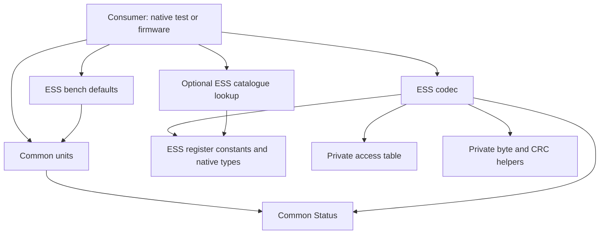

# MotorControl-RS architecture review

Reviewed on 2026-10-03 against library version 0.3.0, commit `2c9970c`.
This report describes the code that exists, how its parts connect, and the
next boundaries to establish. The [architecture contract](architecture.md)
remains the detailed design baseline; names marked **planned** below are not
callable APIs yet.

Update after this snapshot: the [standalone runner](runner.md) is implemented
in version 0.4.0 with native fake tests. Its hardware adapter is still pending.
The inventory and "next work" findings below describe the reviewed 0.3.0
snapshot; consult the runner guide and backlog for current transport progress.

## 1. Assessment

The current structure is a suitable base for both a standalone motor test
application and a FieldCore device module. Keep the present separation:
common calculations, drive-specific protocol code, and application-owned
hardware. There is no reason to reorganize working files or introduce a
general driver framework at this stage.

The implemented library is small: three C++ source files provide units,
ESS frame handling and register descriptions. Public code has no Arduino,
ESP-IDF or FieldCore dependency. It does not allocate heap memory, create tasks,
read clocks, log messages or retain transaction buffers. This makes the
existing behavior practical to test on a desktop and reuse in firmware.

This is still an early foundation. The standalone program is an offline
preview; motion preparation, typed commands, sequencing and actual bus
integration remain to be built. The present tests do not establish an
industrial qualification or guaranteed motor stopping behavior. The main
work ahead is making those boundaries observable and testable, then
qualifying the exact hardware and firmware.

## 2. What exists and where it lives

The package name is `MotorControl-RS`. C++ headers and namespace use
`MotorControlRS`; the ESS family uses `MotorControlRS::ESS_RS`. The checkout
and GitHub repository are still named `ESS23-RS`.

| Current location | Responsibility |
| --- | --- |
| [MotorControlRS.h](../include/MotorControlRS/MotorControlRS.h) | Small common entry header: includes Status, Units and Version. Drive headers are included explicitly. |
| [Status.h](../include/MotorControlRS/Status.h) | Result of a pure library call: error category, numeric detail and static diagnostic text. |
| [Units.h](../include/MotorControlRS/Units.h), [Units.cpp](../src/Units.cpp) | Displacement, velocity and acceleration conversion; explicit scales, coordinate bases, polarity and arithmetic checks. Exact integer range/narrowing helpers. |
| [Version.h](../include/MotorControlRS/Version.h) | Generated version constants from package metadata. |
| [ESS Codec.h](../include/MotorControlRS/profiles/ess_rs/Codec.h), [Codec.cpp](../src/profiles/ess_rs/Codec.cpp) | Validate requests, build frames, check replies, expose the minimal probe and convert pairs of raw words. |
| [ESS Types.h](../include/MotorControlRS/profiles/ess_rs/Types.h) | Generated native choices, flags and evidence categories. An enum value is not an implemented operation. |
| [ESS Registers.h](../include/MotorControlRS/profiles/ess_rs/Registers.h), [Registers.cpp](../src/profiles/ess_rs/Registers.cpp) | Generated addresses, descriptors, source notes and indexed lookups. Useful for inspection and diagnostics. |
| [ESS Defaults.h](../include/MotorControlRS/profiles/ess_rs/Defaults.h) | Explicitly labelled bench conversion assumptions. It does not configure or read a drive. |
| [ESS Access.h](../src/profiles/ess_rs/Access.h) | Private generated 320-byte table for readable/single-word-writable addresses. Keeps codec use independent of descriptive catalogue strings. |
| [rtu/Frame.h](../src/rtu/Frame.h) | Private byte packing, CRC and buffer-overlap helpers. Contains no UART or device register policy. |
| [examples/units_preview/main.cpp](../examples/units_preview/main.cpp) | One offline program for desktop or Arduino USB console. Prints conversions and catalogue information. |
| [examples/common/](../examples/common/) | Current board pins, console setting and flash partition file. Future example adapters belong here. |
| [boards/e2_s3_n16r8.json](../boards/e2_s3_n16r8.json), [platformio.ini](../platformio.ini) | E2 ESP32-S3 Arduino build selection and pinned toolchain/platform settings. |
| [CMakeLists.txt](../CMakeLists.txt), [library.json](../library.json) | Native build/test/install, ESP-IDF component registration and PlatformIO packaging. |
| [test/](../test/) | Native unit, catalogue and codec tests; Python checks for register-gap metadata. |
| [scripts/](../scripts/README.md) | Deterministic generators and reference download/hash verification. Development tools, not firmware dependencies. |
| [docs/reference/](reference/) | Source ledger, register evidence, audits and unresolved questions. |
| [docs/vendor/](vendor/), [docs/standards/](standards/), [docs/pdf-extracted-md/](pdf-extracted-md/) | Preserved originals and searchable extracts. Excluded from the distributed library package. |

`Axis.h`, `Profiles.h`, `Sequence.h`, ESS `Commands.h`, a motor CLI and an
ESP-IDF example are **planned**. No placeholder files are needed. The current
`src/Units.cpp` and `src/rtu/Frame.h` should stay where they are until an actual
implementation gives a reason to split them.

## 3. How the current code connects

Arrows below mean "uses". These are existing code dependencies, not UART
traffic. A consumer may use units, the ESS codec or catalogue independently.



There is no dependency from the common units module back into ESS. The
codec does not convert engineering units or decide whether a move is
appropriate. The catalogue describes documented fields; it does not act
as a live device object or implement setters.

The register data follows a separate development-time path:

```text
Original ESS PDFs
  -> reviewed transcription: docs/reference/ess_rs_registers.json
  -> scripts/generate_ess_registers.py
  -> Types.h, Registers.h, Registers.cpp, Access.h and register reference
```

Edit the JSON ledger and regenerate these outputs. Do not hand-edit generated
C++ tables. The generator checks address coverage and keeps undocumented
holes separate from reserved words and entries with unspecified access.
FC10's four admitted write windows remain explicit reviewed policy in
`Codec.cpp`; the JSON ledger is not a complete executable motion contract.
The generator is also deliberately ESS-specific: segment geometry and some
homing classifications remain code rules. A change to those parts of the
ledger requires reviewing the generator and independent tests as well.

With the tested static-library build, using the codec does not pull in the
catalogue object and its descriptions. Calling `findRegister()` does. The
current preview deliberately uses that catalogue, so its firmware size is
not a measurement of the smallest possible codec consumer.

## 4. What the public API actually does

| Current API group | Result | What still needs application or future profile work |
| --- | --- | --- |
| `convertDisplacement`, `convertVelocity`, `convertAcceleration` | Checked engineering value and arithmetic error bound | Origin, absolute reference, rounding into a target, limits and device ramp encoding |
| `validateNativePosition`, `narrowNativePosition` | Exact integer range validation/narrowing | Selection of the correct device field range |
| `registerCount`, `registerAt`, `findRegister`, indexed lookups | Immutable source metadata | Readback, configuration and complete native command execution |
| `validate*Request`, `build*Registers` | Request admission result or encoded bytes | Typed value meaning, readiness, side effects and transmission |
| `validateReadResponseExpected`, `parse*` | Checked reply or structured failure | Complete-frame collection, response correlation and motion completion |
| `buildProbe`, `parseProbe` | One model-word read and its raw response | Confirmed identity, discovery scan, readiness and freshness of other fields |
| `encodeInt32` / `decodeInt32` and unsigned variants | Explicit word-order conversion | Proof that a particular ESS field uses that signed encoding and scale |

Units are explicit at each call. Changing preferred units changes host
interpretation, not drive configuration. Steps, encoder counts, load angles
and machine travel have different bases. Gear ratio and lead are required
only when the conversion crosses those bases. A scale marked `ASSUMED` is
usable but remains an assumption; application policy decides when readback
or qualification is required. The arithmetic error bound does not cover an
incorrect mechanical ratio or encoder setting.

The wire API currently allows addressed unicast, FC03 reads of up to 16
reviewed words, FC06 single-word writes and four documented FC10 windows.
The largest currently supported request is 21 bytes; the largest normal
read reply is 37 bytes. Write acknowledgements are 8 bytes and exceptions
are 5 bytes. These are implementation bounds, not universal drive limits.

Builders return a byte length or zero and preserve the buffer on failure.
They reject null, short or overlapping output buffers themselves. The separate
request validators explain request-policy failures such as an unsupported
address/window; they do not check output storage. A zero-length result must
never be submitted to a transport. Parsers require request expectations;
output capacity is not the expected register count. Failed parsing preserves
payload outputs and resets an explicit output count to zero. Diagnostic and
count storage must not alias frame or payload storage.

## 5. Ownership and an example transaction

| Concern | Library | Standalone application or FieldCore |
| --- | --- | --- |
| Units, frame bytes and response validation | Pure calculations and checked codecs | Supplies configuration and expected request details |
| Buffers | Borrows valid storage for one call | Owns TX/RX storage through transaction completion |
| UART and direction pin | No hardware access | Opens UART, controls DE/RE and verifies physical TX completion |
| Time and shared bus | No clock or scheduler | Owns RTU gaps, timeouts, arbitration and late-frame recovery |
| Device sequence, **planned** | Advances bounded caller-owned state and yields the next work item | Owns state, feeds events/time and schedules yielded work |
| Cached feedback and health | Current core retains neither | Owns observations, timestamps, failure counters and health policy |
| Retry and recovery | No automatic attempt | Applies explicit policy; preserves uncertain write outcomes |
| Console, logging and storage | No services | Parses commands, records evidence and persists selected settings |

For a model-word probe, the intended path is:

1. The application selects an explicit target address and host serial format.
2. `ESS_RS::buildProbe()` fills its caller's eight-byte request buffer.
3. The bus owner waits for admission, transmits it and releases DE after the
   last stop bit. It collects a complete reply or records a transport failure.
4. `ESS_RS::parseProbe()` checks address, function, exact length, count and CRC.
5. On success, the application stores the raw model word and observation time.
   On failure, it retains the previous valid observation and records the attempt.

Steps 2 and 4 exist. This repository does not yet implement the live bus owner
in step 3. Neither a builder nor a parser sends data by itself.

The bus owner is essential to correctness: an FC03 reply carries no register
start address or transaction ID. A delayed reply of the same shape cannot be
distinguished by CRC and count alone. Likewise, an FC06 local echo can have
exactly the same bytes as the real acknowledgement. These problems require
transport evidence and recovery policy; adding another parser check cannot
recover information absent from the wire.

## 6. How motion should be added

The [axis contract](axis_contract.md) and [profile contract](profile_contract.md)
already describe the intended behavior. Implement it in small steps:

```text
Typed application request, e.g. relative move in degrees
  -> common preparation: units, reference, limits and capability checks
  -> ESS preparation: verified register values and device command sequence
  -> caller-owned operation state yields a transaction
  -> application bus owner performs it
  -> checked reply or timeout event advances the operation
  -> application retains acknowledgement and completion evidence separately
```

The preparation and sequence API in this flow is **planned**. It should be
shared by the standalone program and FieldCore so neither consumer needs
its own ESS setup/start/observe logic. One advancement processes one event;
it does not sleep or run a private UART loop. Motor-specific commands that
do not fit the common vocabulary remain explicit ESS extensions.

Stop must interrupt pending application work while the owner settles the
transaction already on the wire. Cancelling a local wait is not a stop.
An acknowledged start is not completed movement. A timeout after transmission
can leave execution unknown; automatic replay of a relative move can move
twice. Tests for these cases belong with the first sequence implementation,
before increasing command coverage.

Additional serial families should reuse proven byte helpers and common
motion meaning while keeping their own limits, register encodings, timing
and completion rules. Leadshine remains a design comparison, not a supported
profile. CANopen remains a separate future library under the accepted scope.

## 7. Standalone testing application

The existing preview exercises public units and catalogue APIs on a desktop
or the E2 Arduino build. It does not initialize RS485, accept motor commands
or test motor behavior. Its selected pins are TX47, RX48 and DE21; these
remain example configuration. Core headers contain no board pins.

The next standalone application should have a small platform entry point,
shared command dispatch and diagnostics under `examples/common/`, and an
application-owned transport. Arduino and ESP-IDF adapters supply console,
UART, GPIO and time. Native tests can supply a fake transport to inject
fragmented replies, timeouts, echo and late frames.

The CLI should call the same public motion/profile APIs that upper firmware
uses. It should not perform its own angle conversion or construct ESS
register sequences. `status` and `health` show cached evidence; explicit
read/check commands refresh it. `reset` clears local statistics, `recover`
repairs host transport, and motor actions have explicit names. See the
[CLI contract](cli_contract.md) for the agreed vocabulary.

The sibling repositories provide useful codec and cooperative transport
patterns, but their example transports are not interchangeable. SHZK/VTN
have blocking-flush considerations; VibWire's helper is restricted to
eight-byte FC04 requests. Audit and adapt the necessary pieces rather than
copy a sensor transport with its retry assumptions. Details are in the
[ecosystem review](reference/02_ecosystem_review.md).

## 8. FieldCore integration

FieldCore source was rechecked at commit `063ca063`. Its unrelated local
settings/storage edits were left untouched. The source links in this section
navigate the adjacent checkout and require that checkout to be present;
they are evidence links, not build dependencies.

FieldCore should consume this library through a motor device module in its
own repository. That module owns axis configuration, operation state and
cached observations. FieldCore's existing RS485 owner remains the sole owner
of the physical bus. Do not link the standalone CLI/transport into FieldCore
or create a second UART task for the motor library.

The intended connection is:

```text
FieldCore command / product policy
  -> motor device module and public MotorControlRS API
  -> existing RS485 transaction owner and hardware backend
  -> received observation back to the module and checked library parser
  -> cached motor state, retained operation result and FieldCore health
```

The existing binding already has useful ownership hooks: `start`, `poll`,
`takeStep`, `acceptObservation`, `takeResult` and cached status. Permanent
modules and immutable bindings are assembled in product composition. The
future motor module can follow this lifetime pattern while using a richer
motion command/result contract. See
[Rs485DeviceBinding.h](../../FieldCore-node/include/TunnelMonitor/rs485/Rs485DeviceBinding.h)
and [TunnelMonitorRuntimeComposition.cpp](../../FieldCore-node/src/product/tunnelmonitor/TunnelMonitorRuntimeComposition.cpp),
especially the module/binding construction near lines 343-346.

An observation's RX pointer is borrowed. `Rs485Task::finishTransport()` calls
the module's `acceptObservation()` and then clears the receive buffer. Parse
and copy the required facts inside that callback; never keep the pointer for
a later tick. Device waits should release the bus for other modules.

| Current FieldCore limitation | Source evidence | Required integration work |
| --- | --- | --- |
| Eight-byte TX buffer | `kRs485TransactionTxCapacity`, owner contract line 10 | Admit the reviewed ESS requests up to 21 bytes; review queue and transaction storage together. |
| Request-identical RX prefixes are removed | `Rs485Task.cpp`, near line 1216 | Introduce an explicit, qualified echo policy so an FC06 acknowledgement is neither discarded nor confused with local echo. |
| Completion supports fixed length or suffix | Owner contract line 27; `responseComplete()` near line 1305 | Handle normal replies and five-byte exceptions promptly, and establish RTU frame boundaries. An exception can currently remain until timeout; it is not necessarily discarded. |
| Five-millisecond worker polling and byte batches without receive timestamps | `Rs485Diagnostics.cpp`, line 117; backend `read()`, near line 190 | Provide or qualify receive timing/idle evidence. Buffered reads cannot reconstruct sub-millisecond gaps; a long inter-request delay does not solve this. |
| Only Probe, Measure and ReadLast requests; readings use float | `DeviceMeasurement.h`, lines 25, 63 and 110 | Add explicit typed motion commands and retained results. Preserve exact native position integers separately from float telemetry. |
| Local cancellation and sensor retry policies | `Rs485Task::processCancelWork()`; sensor module retry handling | Define stop scheduling, late-reply handling and uncertain execution. Do not equate local cancel/module disable with motor stop/release or replay timed-out motion. |
| Only selected baud rates with 8N1 are admitted | `rs485SerialFormatValid()`, owner contract line 78 | Advertise the supported format subset and extend only when needed; do not claim all ESS or other drive formats already work. |

Relevant source files are the
[owner transaction contract](../../FieldCore-node/include/TunnelMonitor/rs485/Rs485OwnerTransaction.h),
[Rs485Task.cpp](../../FieldCore-node/src/rs485/Rs485Task.cpp),
[Rs485Diagnostics.cpp](../../FieldCore-node/src/rs485/Rs485Diagnostics.cpp),
[ArduinoRs485Backend.cpp](../../FieldCore-node/src/rs485/ArduinoRs485Backend.cpp),
[DeviceMeasurement.h](../../FieldCore-node/include/TunnelMonitor/contracts/DeviceMeasurement.h)
and [ShzkDeviceModule.cpp](../../FieldCore-node/src/rs485/ShzkDeviceModule.cpp).

Physical board wiring and selected product functionality are separate.
The retained TunnelMonitor HW2.0 board definition matches TX47/RX48/DE21,
but the current CO2Control product has no RS485 device composition. A matching
pinout does not establish an available firmware motor path. See the
[board audit](reference/04_co2control_platform.md) for provenance.

Library behavior must not be reduced to fit FieldCore's current sensor path.
Qualify the small standalone read path first. Then make narrowly tested
FieldCore transport changes and add a read-only ESS module before exposing
motion through an explicit application command contract.

## 9. Debugging and verification

Keep these four meanings separate in logs and APIs:

| Evidence | Example | Owner |
| --- | --- | --- |
| Pure-call result | Bad CRC, unsupported window, missing scale | `Status`; optional `FrameError` for parser category |
| Device data | Raw alarm word, drive released, position | Future typed profile decoding and application cache |
| Transaction/operation outcome | Not sent, timed out after TX, acknowledged, completion observed | Application transport and future caller-owned sequence |
| Health/freshness | Communication degraded, stale position, drive alarm | Application policy over retained observations |

Interpret `Status.detail` together with the operation and error category.
It may be a raw ESS exception byte, a `UnitError`, a frame reason or a request
argument. It is not one universal error enum. Static message text is for
people; program logic should use documented categories.

For the later transport, record target/serial settings, request register and
count, raw TX/RX with actual lengths, transaction phase and timestamps,
parser result, and retained operation outcome. Record each observation's
age separately. A fresh identity reply must not make an old position fresh.
Keep this logging in the application so the library remains easy to test
without a logger or clock.

The current native suite was rerun for this review: **7/7 checks passed**.
It covers units, register catalogue/access, frame fixtures and malformed
responses, the offline preview, generated-file freshness and gap validation.
The earlier header, installed-package and Arduino build results remain in
[verification.md](verification.md); they were not repeated for this report.

Run the native checks with:

```sh
cmake -S . -B build/motorcontrol-native -G Ninja -DCMAKE_BUILD_TYPE=Release
cmake --build build/motorcontrol-native
ctest --test-dir build/motorcontrol-native --output-on-failure
```

CMake currently treats Python 3.10+ as optional. Without it, only four CTest
checks are registered, so a successful run alone does not establish that
generated files and gap metadata were checked. Full repository validation
must include those Python checks. Ordinary consumers need only the generated
C++ code. Native ESP-IDF and ESP32-S2 firmware qualification remain pending.

CMake consumers can use `add_subdirectory` or an installed package with
`find_package(MotorControlRS CONFIG REQUIRED)`, linking
`MotorControlRS::MotorControlRS`. ESP-IDF component registration is present,
but its existence is not a completed IDF firmware test. The verified native
package path is static linking; Windows DLL export support is not established.
The units implementation requires `double` with at least 53 bits of precision.

No serial port was opened and no firmware was uploaded for this review.
UART timing, motion, stop behavior and persistence remain unqualified.

## 10. Review findings and next work

No new runtime defect or framework dependency leak was found in the reviewed
core. Keep the existing free functions, fixed buffers, small helpers and
separate catalogue. Avoid splitting the three source files merely to make
the folder tree look more complete.

| Priority | Finding | Recommended next step |
| --- | --- | --- |
| Before bus bring-up | There is no example bus owner or transaction trace yet. | Implement one bounded read-only transaction path with fake-transport tests, then qualify the minimal probe on E2. |
| Before movement | Raw writable registers are not typed motion validation or command sequencing. | Add explicit state decoders and checked command preparation; test lost acknowledgements, partial setup and stop interruption with the first workflow. |
| Before FieldCore integration | Current sensor command/transport assumptions cannot carry the full motor contract. | Extend the FieldCore owner and typed device contract in that repository; keep MotorControl-RS independent. |
| For repeatable releases | Header/package/binary64 checks are recorded manual verification; Python checks are optional and no CI workflow is checked in. | Add a small repeatable verification command and CI in a separate block; require the complete check set for releases. |
| During each implementation block | Design documents contain more APIs than the current headers. | Keep current code status explicit, update the backlog, and add files only with real behavior and tests. |

The [backlog](backlog.md) tracks these steps. Source uncertainties and timing
limits remain in the [implementation reference](reference/01_implementation_reference.md)
and [timing audit](reference/09_timing_and_gap_audit.md). Resolve those through
document evidence and measured behavior, without inventing register meanings
or treating host timeout settings as drive guarantees.
