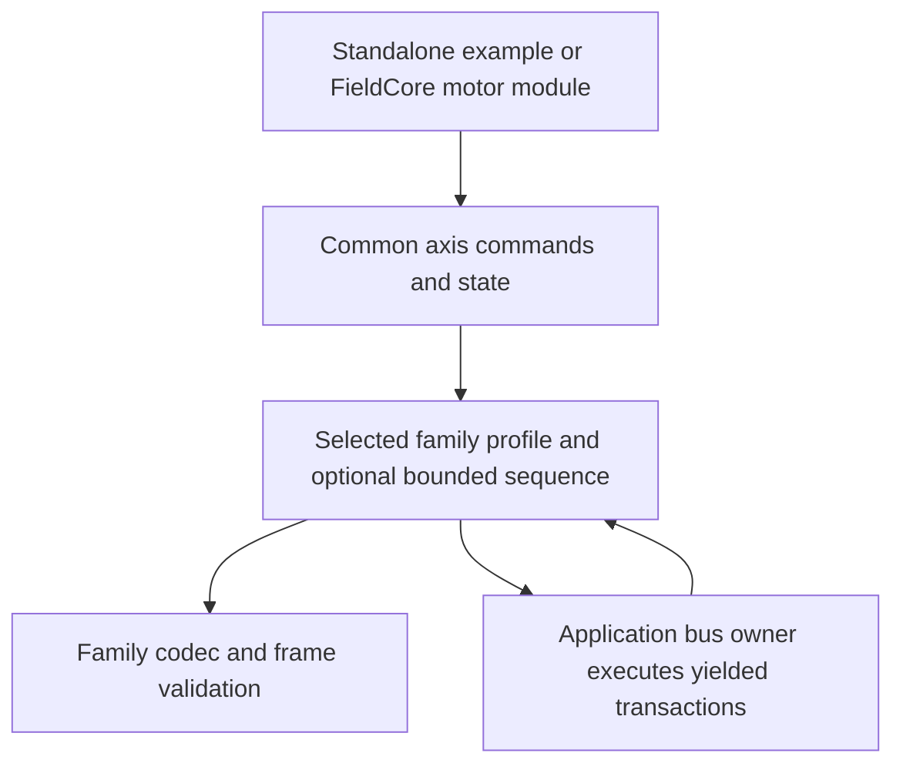

# Multi vendor serial motion feasibility

Research date: 2026-10-02. The user adopted the general-library direction from
this review. The [architecture](../architecture.md),
[axis contract](../axis_contract.md) and [profile contract](../profile_contract.md)
are the resulting design baseline. This report preserves manufacturer
evidence and its limits; it is not a supported-device list or hardware
qualification. No implementation or repository rename is part of this review.

## Recommendation

A common interface for selected serial stepper and servo drives is viable.
Use explicit drive profiles over family-specific codecs and operation
sequences. Keep ESS-RS as the first implementation and test the abstraction
against a second substantially different family before freezing its API.

The useful scope is drive-managed positioning, velocity operation, homing,
stopping and observation. RS485 supplies the electrical link; it does not
standardize motion commands. Even Modbus drives differ in register meaning,
units, trigger rules, completion evidence and command queues. A profile must
identify family/model, protocol and qualified firmware, not just manufacturer
or whether the motor is a stepper or servo.

One repository can contain the common contracts and several profiles while
remaining a small, framework-neutral library. There is no need for runtime
plugins, dynamic allocation, a universal register database or a new bus owner.

## Manufacturer evidence

The following are documentation findings. Each family needs its own tests
and live qualification before being advertised as supported. Page references
are printed pages unless explicitly called physical PDF pages.

### STEPPERONLINE ESS RS

The downloaded function manual establishes FC03/06/10, parameter writes and
separate motion/auxiliary commands. Read count, word order, status polarity
and several inconsistent tables are already recorded in the
[implementation reference](01_implementation_reference.md). This is the first
target, with RS20/RS10 hardware references, not evidence of compatibility with
every STEPPERONLINE or DM-PR product. The original PDF remains authoritative.

### Leadshine iEM RS

The official manual distinguishes RS485 motion control from RS232 tuning
(section 4.1). Its PR workflow stages position/velocity/homing path data,
then triggers execution, with a separate completion readback. It also supports
an immediate-trigger write. Speed is expressed in rpm and acceleration in
ms/1000 rpm. Serial jog requires repeated triggers less than 50 ms apart.
This needs an operation sequence and timing contract, not an ESS register
substitution. Evidence: [iEM-RS manual](https://www.leadshine.com/upfiles/downloads/3b01ef83987a2abfffcb4d4301a9cf4b_1689587677198.pdf),
sections 4.1, 5.3.2, 5.4.1, 5.5.3-4; physical PDF pages 16, 36-37, 42-43.

The related iCS-RS manual exposes a similar trigger pattern, but full
compatibility was not established. Keep it a separate candidate until
reviewed, rather than infer equivalence from shared addresses.
[Official iCS-RS material](https://www.leadshine.com/products/integrated-closed-loop-stepper-motor/closed-loop-stepper/ics-rs-series.html).

### Oriental Motor AZ

AZD-KD is a concrete Modbus/RS485 target. The function manual documents
positioning, continuous operation and home return, with READY, MOVE, IN-POS
and HOME-END observations. Direct-data operation uses signed position steps,
speed in Hz, configurable trigger behavior and one next-operation buffer.
An absolute home return is not necessarily a switch-search homing procedure.
The communication timeout is configurable and can be disabled; a timeout
raises alarm 85h. These are profile-specific behaviors.
[AZ function manual HM-60262E](https://www.orientalmotor.com/products/pdfs/opmanuals/HM-60262E.pdf),
pp. 220, 255-263, 277-280, 286;
[AZD-KD product](https://catalog.orientalmotor.com/en-us/item/azd-closed-loop-absolute-type-drivers-dc/azd-absolute-stepper-driver-stored-data-dc/azd-kd).

### Nanotec PD4 E and Plug and Drive Interface

PD4-E Modbus supports profile positioning through CiA402 control/status
objects: target position, a new-setpoint handshake, acknowledgement and
target-reached observation. Its Modbus process image maps object data;
object indexes are not automatically RTU register addresses. Object access
also has a documented FC43/MEI13 path.
[PD4-E manual v1.6.0 for FIR-v2213](https://www.nanotec.com/fileadmin/files/Handbuecher/Plug_Drive/PD4-E/fir-v2213/PD4E_ModbusRTU_Technical-Manual_V1.6.0.pdf),
pp. 57-58, 103, 115-116.

Nanotec's alternative PDI interface handles state-machine work inside the
drive and exposes position, velocity, torque, home and quickstop commands.
Repeated commands use a toggle bit or NOP followed by reissue. PDI can
overwrite underlying control and target objects, so it must not be mixed
casually with direct CiA402 control.
These are distinct semantic profiles within one manufacturer.
[PDI functional description v1.0.1](https://www.nanotec.com/fileadmin/files/Handbuecher/Plug_Drive/Plug_Drive_Interface/Functional-Description_Plug_Drive-Interface_V1.0.1.pdf),
pp. 5-6, 9-15.

### Applied Motion SSDC R and SCL

The SSDC hardware manual distinguishes RS485/422 `-R`, CANopen `-C` and
Ethernet `-IP` variants. Addressed ASCII SCL has model-specific command
coverage; its node addresses can be characters rather than Modbus numbers.
[SSDC hardware manual 920-0148C](https://applied-motion.s3.amazonaws.com/documents/Manuals/920-0148C-SSDC03-06-10_RevC.pdf),
pp. 3, 9-12. Revision C was inspected, not asserted to be the latest revision.

SCL offers relative/absolute moves, jogging, homing and status. Position units
vary between stepper steps and servo encoder counts. It distinguishes
immediate/buffered commands and accepted/queued acknowledgements. `ST` stops
the current command while preserving the remaining queue; `SK` clears the
queue. A generic stop operation therefore needs an explicit queue policy.
[Host Command Reference 920-0002W](https://applied-motion.s3.amazonaws.com/documents/Manuals/Host-Command-Reference_920-0002W.pdf),
pp. 64, 77, 109, 112, 230, 245, 249, 254, 295-310.

The vendor's Modbus command path also shows parameter staging followed by a
command-register trigger, with different wire units from ASCII SCL.
[Modbus manual 920-0072E](https://applied-motion.s3.amazonaws.com/documents/Manuals/ModbusManual_920-0072E.pdf),
pp. 5-10. Its listed model scope does not establish support on every drive.

The inspected communications-watchdog note explicitly covers Ethernet
versions. Equivalent RS485 watchdog behavior for SSDC-R remains unverified;
do not infer it from shared command names.
[Watchdog application note APPN0050A](https://applied-motion.s3.amazonaws.com/documents/Application-Notes/APPN0050A-Using-Communications-Watchdog.pdf),
pp. 2-3.

### MOONS M2 servo drives

The M2DC product documentation explicitly lists RS485 Modbus RTU and SCL
position, velocity, torque and homing modes, and distinguishes RS485 `-R`
models from other communication variants. This supplies a servo-drive
example beyond the closed-loop stepper products above.
[M2DC series documentation](https://www.moonsindustries.com/series/m2dc-series-servo-drives-a010402).

The linked Modbus manual contains an M2 register table with encoder feedback,
position, velocity, torque/current and homing settings. Its command interface
stages parameters and then triggers an encoded SCL command. The position
example uses separate FC10 setup and FC06 execution. Its compatibility
appendix explicitly lists M2DV-R firmware requirements; this does not qualify
every M2DC variant. Model and firmware qualification must remain separate
from the broader product-family feature list.
[Modbus RTU manual revision 1.2](https://www.moonsindustries.com/medias/Modbus-RTU-Manual-EN20171018.pdf?attachment=true&context=bWFzdGVyfHJvb3R8MTUwNTUzN3xhcHBsaWNhdGlvbi9wZGZ8aGNiL2gwNy84ODMwMzg0MDc4ODc4LnBkZnwzM2U1ZGExNTc1NTAwZTUwNzhhNjQwZjE1MTg1MzM5ZDVmMmE5NTk4NjYyNGM5ODZmZDE5MjU1YmU3YTA3NWVm),
pp. 8, 27-34, 36-38.

### ADI Trinamic TMCL

TMCM-1181 executes position, rotation and stop commands over RS485 using
nine-byte TMCL packets and an additive checksum. This is not Modbus. An
accepted move command returns before movement completes. Module/axis
addressing and parameter units belong to the selected module profile.
[TMCM-1181 firmware manual, firmware 1.42, revision 1.02](https://www.analog.com/media/en/dsp-documentation/software-manuals/TMCM-1181_TMCL-firmware_manual_Fw1.42_Rev1.02.pdf),
pp. 10-12, 23-26.

### Makerbase MKS SERVO42D and 57D

The official firmware-1.0.9 manuals document both proprietary serial control
and a Modbus command path. The Modbus manual warns that the D-series register
space is not continuously readable/writable. Examples use FC04 reads and
FC10 packed motion commands. It also describes nonstandard failure echoes,
48-bit encoder feedback, and speed scaling that depends on subdivision.
Heartbeat protection is configurable and disabled at zero. Treat this as a
specific firmware/protocol profile with unresolved documentation details,
not a generic register-map target.
[Official Modbus manual](https://github.com/makerbase-motor/MKS-SERVO42D-57D/blob/master/User%20Manual/V1.0.9/MKS%20SERVO42%2657D_Modbus%20RTU%20User%20Manual%20V1.0.9.pdf),
pp. 9, 11, 21, 44, 53, 56;
[official proprietary serial manual](https://github.com/makerbase-motor/MKS-SERVO42D-57D/blob/master/User%20Manual/V1.0.9/MKS%20SERVO42%2657D_RS485%20User%20Manual%20V1.0.9.pdf).

Both original PDFs were downloaded to temporary storage for inspection;
the Modbus speed and relative-motion pages were also visually checked.

### Novanta IMS Lexium MDrive

The manufacturer's MCode tutorial demonstrates RS422/485 absolute and
relative moves and continuous slew. Motion units depend on microstep and
encoder configuration. This is another feasible family backend, with a
different command language and scaling contract.
[Manufacturer motion tutorial](https://www.novantaims.com/lmd/support/lmdxm/basic-motion-commands.php).
This establishes the basic motion surface only, not full stop/watchdog or
firmware compatibility.

### Evidence gaps

JMC's `iHSV60-30-40-48-RC` product advertises Modbus RTU, while the plain iHSV
manual covers pulse/direction/PWM and RS232 configuration. The exact `-RC`
motion protocol archive was not successfully inspected. It remains a
candidate, not a documented backend in this review.
[JMC RC product](https://www.jmc-motor.com/product/102.html),
[plain iHSV manual](https://www.jmc-motor.com/uploads/20240730/1cf02d411ba42d6a61bb4df55b64b835.pdf).

Delta ASDA-B2/B3 official manual downloads redirected to a terms/verification
page. Search excerpts and product pages were insufficient to qualify exact
serial positioning behavior, so no compatibility claim is made here.

## Existing implementation patterns

Official PyTrinamic separates connection classes from selected module classes.
Its serial interface supports UART/RS232/RS485; the TMCM1260 implementation
exposes common rotation, stop and absolute/relative move functions through a
supplied connection. This supports the profile approach, although its Python
runtime and transport ownership do not match this embedded library.
[Interface documentation](https://analogdevicesinc.github.io/PyTrinamic/getting_started.html),
[module source](https://github.com/analogdevicesinc/PyTrinamic/blob/master/pytrinamic/modules/TMCM1260.py).

Nanotec NanoLib separates object access from fieldbus communication. It is a
desktop library and its manual excludes synchronous multi-axis movement and
generally time-sensitive applications. It is an architecture reference, not
an ESP32 dependency.
[NanoLib C++ manual v1.4.5](https://www.nanotec.com/fileadmin/files/Software/NanoLib/NanoLib-C___User_Manual_V1.4.5.pdf),
pp. 5-7, 25-26.

EPICS motor support demonstrates a common controller/axis interface implemented
by manufacturer drivers, while retaining controller-specific features.
Its threads and EPICS runtime are outside our intended core. The useful
precedent is the separation of common operations and concrete drivers.
[EPICS driver architecture](https://epics-modules.github.io/motor/motorDeviceDriver.html).

These examples establish architectural precedent. They do not supply a
ready-made, qualified, heap-free ESP32 library covering the families above.

## Proposed common interface

This section records the engineering conclusions inferred from the evidence.
The adopted, more detailed axis contract now defines the common API, including
explicit step/angle/travel modes. These remain unimplemented contracts.

| Common operation or data | Required contract |
| --- | --- |
| Identity and capabilities | Explicit family/protocol/firmware selection; distinguish verified, assumed, unsupported and unverified |
| Read state | Independent validity/age for drive state, alarms, actual position, commanded position, speed and inputs |
| Absolute and relative positioning | Explicit reference frame, exact target, scaling and supported motion profile; reject unrepresentable requests |
| Velocity operation | Actual units, range, acceleration policy and any keepalive requirement |
| Stop | Requested stop behavior, queue disposition and completion evidence; unsupported behavior is an error |
| Enable and release | Distinguish drive power stage from application enable/polling and any external enable interlock |
| Homing | Supported method and origin semantics; home return, switch search and setting a coordinate are separate |
| Fault clear | Explicit operation, raw alarm retained, result verified where possible |

Torque, tuning, electronic gearing, I/O remapping, persistent settings,
device queues, synchronized starts and proprietary programs remain optional
capabilities or typed family extensions. Do not approximate an unsupported
feature silently or hide it behind an unrestricted write-register API.

Preserve raw integer values, using a representation wide enough for the
selected profile; a universal 32-bit position would already lose MKS feedback.
Engineering-unit conversion needs explicit scale, direction, gearing and
coordinate origin, with range and rounding checks. Microsteps, encoder counts,
user units and machine travel are different quantities. Report effective
quantized settings. Do not present commanded position as measured feedback.

Retain separate command phases: admitted, transmitted, acknowledged,
device-queued, executing, completed, rejected and outcome unknown, where the
profile can actually establish them. A protocol success is not motor health
or proof of motion completion. Host cancellation is not a device stop.

## Ownership and implementation shape

Keep per-family codecs stateless and bounded. A shared command may
need more than one frame, conditional readback or a trigger handshake, so a
single `buildMove` call cannot represent every operation completely.

A small optional sequencer can operate on caller-owned fixed state, receive
observations and caller time, and yield the next transaction/wait/result.
This would be a deliberate addition above the codec, justified by concrete
family sequences. It must not own UART, GPIO, clocks, retries, tasks, storage
or shared-bus arbitration. Native tests can drive it without hardware.

Yielded work must carry required service deadlines, including periodic jog
refreshes. The application bus owner must reject operations whose deadlines
it cannot meet and report any missed deadline to the operation context. The
profile defines the resulting command uncertainty and documented device
behavior; a missed refresh is not evidence that a physical stop completed.

Profiles must also describe replay semantics. A lost acknowledgement after
a relative move or trigger leaves execution uncertain; the application must
not apply a sensor-style automatic retry. Repeated writes, multi-frame setup
and stale responses need operation-specific recovery rules. The shared
interface must preserve this uncertainty through cancellation and rebinding.

Initially use explicit finite dispatch or a small static function table with
only implemented profiles. Keep one operation context per axis and one bus
owner per UART. An explicit stop must be able to interrupt an active move,
homing or velocity operation; retain the interrupted operation's outcome or
uncertainty separately from the stop result. Build-time selection can omit
unused profiles. A runtime
selection is a rebind operation performed only after outstanding work is
settled; it invalidates identity, origin and scale assumptions while retaining
uncertain results against the original target. Generic scanning must not send
guessed motion/configuration commands to identify a drive.

The same contracts and sequence logic can serve the standalone console and
FieldCore. Its existing bus remains the hardware owner. The
[FieldCore gaps](02_ecosystem_review.md#fieldcore-integration-gaps) still apply;
TMCL's nine-byte packet also exceeds its current eight-byte TX capacity.
Additional protocols need explicit framing/response contracts. Merely
supporting two families in one library does not establish that their protocols
can coexist safely on the same physical bus.

## Standalone CLI and health implications

Keep the familiar `help`, `version`, `config`, `status`, `health`, `stats`,
`read` and explicit `motor ...` vocabulary from the
[CLI contract](../cli_contract.md). The adopted scope includes explicit host
profile selection and capability inspection. Selection changes local
interpretation and never commissions or moves a drive. Address syntax,
limits and discovery behavior belong to the selected protocol; the ESS
numeric `useaddr` contract cannot cover every ASCII or module/axis address.

Common motor commands must show supported modes, units and stop policy for
the selected profile. Unsupported operations fail before any write. Put
family-specific tuning and persistence under explicit family commands; the
common console should not pretend that every drive shares ESS registers.

Preserve the sibling codec `Status` convention for parsing/validation.
Keep transport outcome, device observations and motion progress separate.
The application owns cached snapshots, observation age and health policy.
Report communication health separately from drive readiness, alarms and
position validity; absent feedback is unavailable, not zero or healthy.
Retain raw family alarms alongside any normalized categories.

The same operation contracts can support standalone and FieldCore consoles.
Changing a profile should invalidate its cached identity, scaling and state,
while retaining historical and uncertain operations under their original
target. A common console does not remove the need for family-specific
commissioning instructions or hardware qualification.

## Scope limits and qualification order

Use drive-internal trajectories for ordinary point-to-point automation.
Serial throughput, response delays, other bus users and device keepalives
limit host command cadence. For illustration, an eight-byte request and a
37-byte reply at 9600 baud/8N1 require about 46.9 ms of wire time alone
(`45 * 10 / 9600` seconds), before gaps or device processing. That is a
calculation, not a measured drive result.

Do not promise cross-vendor coordinated trajectories, deterministic simultaneous
starts or a common torque-control loop. Such features need a separate bus and
drive capability design. A host timeout cannot itself stop an unreachable
motor; communication-loss behavior must be qualified per profile.

Implementation order under the adopted broader scope:

1. Keep ESS-RS as the concrete first backend and finish its unresolved register
   contract. The architecture uses `RS485Motion` as its working common identity.
2. Design against the contrasting Leadshine iEM-RS profile, and obtain
   hardware before claiming its support. Oriental AZ remains another candidate.
3. Test the small common command/state/capability contract using both profiles;
   leave protocol differences inside codecs and finite operation sequences.
4. Qualify no-echo/echo behavior, exceptions, late responses, lost write
   acknowledgements, partial setup, homing/stop outcomes and power loss.
   Test that unsupported operations and invalid scaling never emit writes.
5. Extend to a non-Modbus family only for a concrete target requirement, then
   independently validate its address, framing and bus-sharing assumptions.

The result can be one reusable serial motion library with an ESS backend and
room for selected others. It should advertise exactly the model/firmware
profiles that have passed qualification, not universal RS485 motor support.
