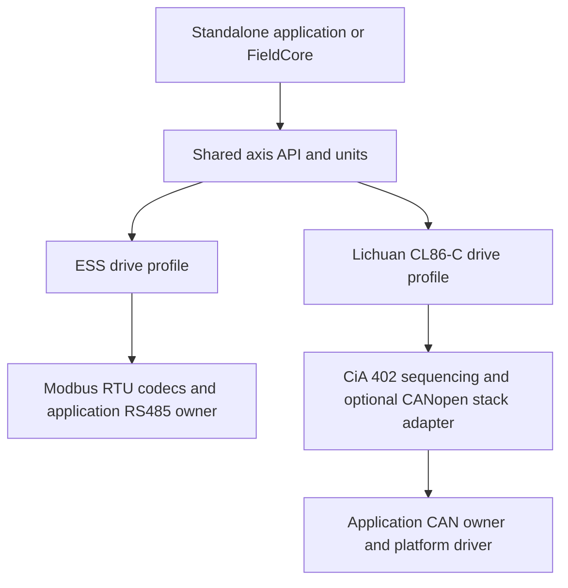

# CANopen and RS485 motion library feasibility

Reviewed on 2026-10-02 and completed on 2026-10-03. This is a recommendation for the user's proposed
CANopen extension, not an accepted implementation scope or a claim of device
support. The requested concrete candidate is the Lichuan CL86-C. The existing
ESS units/catalogue implementation remains unchanged by this review.

**Recommendation: keep one motion library repository, with a shared axis layer
and separately selectable Modbus RTU and CANopen implementations.** Limit the
CANopen side to explicitly supported CiA 402 drives and initially to trajectories
executed inside the drive. This preserves useful reuse without becoming a
universal motor/protocol framework.

The communication work is substantial. It would be misleading to describe
CANopen as another UART adapter or claim that architecture/units account for
most of the remaining implementation. The first CANopen backend needs its own
network handling, drive-state logic, event routing and failure tests. Once
those are established, additional compatible CANopen drives can reuse them.

## Lichuan CL86-C evidence and remaining uncertainty

The manufacturer describes the CL86-C as a CANopen closed-loop stepper drive
supporting CiA 301 and CiA 402, with position, speed and homing modes. This
makes it a plausible first CANopen profile for our scope.
[Lichuan product description](https://en.xlichuan.com/product-xq/143.html)

Search-indexed text of its vendor manual specifically lists Profile Position,
Profile Velocity and Homing, together with SDO/PDO/EMCY services. It describes
RS232 debugging; it does not establish an alternative RS485 runtime interface.
The manufacturer's separate CL86-RX page identifies that model as Modbus RTU.
Do not treat the models as one device with a software-selectable bus.
[CL86-C/OL86-C manual](https://www.lichuanservomotor.com/upload/7257/20230823163201959730.pdf),
[CL86-RX product description](https://en.xlichuan.com/product-xq/217.html)

The manufacturer's download index lists `LC_StepDriverCAN_V1.1.eds` alongside
the 86C manuals. Its applicability to the proposed drive's firmware remains
unverified. [Lichuan download index](https://www.xlichuan.com/download/23.html)

**Evidence limit:** direct product/download requests returned HTTP 403 and the
indexed PDF URL returned HTTP 404, through both browser and ordinary HTTP
retrieval. The statements above rely on indexed manufacturer content, not a
complete original-page audit. No PDF/EDS snapshot or CL86-C object constants
were added. Exact scaling, PDO mappings, stop options, heartbeat consumption,
communication-loss reaction and firmware compatibility still need the actual
manual/EDS and bench checks. Marketing references to synchronized axes do not
establish CSP support or a tested cycle budget.

## What is being compared

RS485 specifies an electrical interface; the ESS protocol here is **Modbus RTU
over RS485**. CANopen combines CAN communication services with device profiles;
the relevant candidate is **Classical CAN with CiA 301 and CiA 402**. CAN alone
does not identify CANopen, and CANopen alone does not establish drive-profile
or motion-mode support.

CiA 402 defines drive states, control/status words and motion modes, but CiA
explicitly notes that optional features and incomplete implementations limit
interchangeability. A supported model/firmware profile remains necessary.
[CiA 402 overview](https://www.can-cia.org/can-knowledge/cia-402-series-canopen-device-profile-for-drives-and-motion-control)

| Concern | ESS Modbus RTU | CANopen drive | Library consequence |
| --- | --- | --- | --- |
| Transport unit | Serial byte frame with slave/function/address/count/CRC | CAN identifier, frame flags, length and payload | Separate frame types and transports |
| Parameters | Vendor register map and paired words | Object dictionary with index/subindex, type and access | Separate native catalogues; common engineering values above them |
| Exchanges | Application request followed by a checked reply | SDO request/reply plus asynchronous PDO, heartbeat and error traffic | CAN reception must run independently of the current motion operation |
| Readiness | ESS enable/alarm/motion flags | CAN controller state, NMT network state and CiA 402 drive state | Preserve those distinctions in observations |
| Completion | Profile-specific status/position evidence | Mode-specific handshake/status/actual values | Same outcome vocabulary, different evidence rules |
| Units | ESS subdivision, encoder interpretation and vendor scaling | Drive-specific object units, gearing and optional scaling objects | Reuse host conversions; retain per-drive wire scaling |
| Scheduling | RTU turnaround, silence and shared-port arbitration | CAN arbitration, queues, PDO timing and optional SYNC | Separate application bus owners and admission rules |

The ESS side is documented in the local [catalogue](05_ess_register_catalog.md).
CANopen SDO is a confirmed dictionary-access service; small values can use an
expedited transfer, while larger data requires other transfer forms.
[CiA SDO](https://www.can-cia.org/can-knowledge/sdo-protocol)

PDOs carry mapped process values. Their interpretation depends on the active
mapping and their transmission may be event-driven or synchronized. They do
not follow a universal one-request/one-reply pattern.
[CiA PDO](https://www.can-cia.org/can-knowledge/pdo-protocol)

## What can be shared

The current `Units.h` implementation already has a suitable boundary: it works
on explicit scales and quantities, with no register, UART or CAN dependency.
Its ESS defaults stay in the ESS profile. They must not become defaults for a
CL86-C and whichever motor/encoder is connected to that external drive.

The following planned behavior is also suitable for sharing:

- Absolute/relative positioning, angles, configured linear travel, velocity,
  supported homing, enable/release, explicit stop and fault-clear intent.
- Unit preferences, coordinate/reference validity, rounding, host limits and
  capability validation before a command is prepared.
- Separation of submission, execution uncertainty, drive acceptance and
  physical completion; retained outcomes after interrupted operations.
- Cached observations with validity/freshness and consistent CLI vocabulary.
- Common behavior tests applied to each backend's supported operations.

These are engineering design conclusions, not claims that the existing library
already implements every item. Shared semantics do not imply identical native
commands. For example, enabling an ESS drive can involve its auxiliary opcode;
a CiA 402 profile must manage the appropriate drive-state transitions and
observe their result. Vendor tuning, I/O and other extensions remain available
through their respective native APIs.

## Where CANopen needs independent work

CANopen has both network management and drive management. NMT operational
permits PDO communication; it does not prove the power drive is operation
enabled. SDO access can be available before the network enters operational.
[CiA NMT](https://www.can-cia.org/can-knowledge/network-management)

Heartbeat establishes node/network liveness, while boot-up announces
initialization. Neither proves that motion completed or that a drive is ready.
EMCY reports an error event; it is not a command to stop a motor.
[CiA error control](https://www.can-cia.org/can-knowledge/error-control-protocols),
[CiA special protocols](https://www.can-cia.org/can-knowledge/special-function-protocols)

Host monitoring of a drive's heartbeat is also different from the drive
detecting loss of its controller. That requires a supported, configured
consumer/watchdog and a documented reaction. It remains a CL86-C qualification
question; the library cannot promise that removing the host stops the shaft.

The additional implementation needs bounded SDO sessions/aborts, node/drive
state, unsolicited-event dispatch, required heartbeat deadlines, restart
handling and selected CAN error recovery. PDO decoding/configuration is added
as the chosen profile requires. An initial SDO-driven move/readback may be
possible without PDO remapping or SYNC; verify that against the actual drive.
There is no requirement to implement every CiA 301 service first. The
application supplies clocks, queues, transport and scheduling. A reusable
protocol engine may advance caller-owned state without owning those services.

A transmit completion is not drive acceptance, and drive acceptance is not
arrival. Ordinary bus acknowledgements cannot supply the missing motion
evidence. After a reset or uncertain write, do not automatically replay a move
or re-enable a drive. Stop handling must retire stale queued motion and use
the selected drive's documented halt/quick-stop behavior. NMT stopped and
drive quick-stop must not be treated as interchangeable operations.

Our normal motion commands and fault-handling rules do not establish a
safety-rated stop function. CiA documents separate safety functionality; that
is outside this proposed initial scope.
[CiA 402 safety distinction](https://www.can-cia.org/can-knowledge/cia-402-series-canopen-device-profile-for-drives-and-motion-control)

## The boundary that keeps this manageable

Start with **drive-generated trajectories**: supply a target, velocity and
ramps, then monitor execution. These fit the existing common-axis intent.

Do not include host-streamed cyclic position/velocity/torque or coordinated
multi-axis trajectories in the first CANopen block. Those require a trajectory
producer, bounded cycle timing, jitter/bus-load assessment and defined behavior
when cycles are missed. A CAN and an RS485 axis sharing an API does not give
them synchronized start or trajectory guarantees.

The distinction is visible in the independent Nanotec N5 CANopen reference:
its manual describes Profile Position/Velocity/Homing and also CSP, in which
cyclic position presets replace drive-calculated ramps. It separately
documents user scaling. These are N5 FIR-v1650 facts, not capabilities to infer
for the CL86-C.
[N5 manual V2.0.1, sections 5.3 and 6.1–6.9](https://www.nanotec.com/fileadmin/files/Handbuecher/Handbuecher_Archiv/Steuerungen/N5/N5_CANopen_Technical-Manual_V2.0.1.pdf?1656012597=)

## Suggested organization and changes to current contracts

Keep one repository with a small common layer, ESS and CL86-C drive modules,
separate protocol implementations and platform examples. Select backends at
build time so RS485 consumers do not acquire a CANopen stack dependency. No
runtime plugin loader, universal register class or arbitrary protocol registry
is needed. A bus-neutral package name would make sense if this expansion is
accepted; renaming is not part of this analysis.

This is a proposed arrangement. The same upper-level move request selects the
appropriate profile; it does not force the two branches to use identical
transaction types or prove that all requested capabilities exist.

The current pure units and ESS catalogue need no conceptual rewrite. Before
implementing the planned sequencing API, update these contract boundaries:

1. A yielded RTU byte transaction and a CAN frame/service request must retain
   their distinct metadata. Do not represent CAN as a UART byte stream.
2. Make the one-in-flight rule specific to RTU and to the relevant CANopen SDO
   channel. It must not block unrelated PDO/heartbeat reception on CAN.
3. Add a bus/session event route before per-axis operation correlation, so
   unsolicited events update the right node without being discarded as a
   response to the wrong operation.
4. Keep network state, drive state and application health separate. Reconcile
   mappings/configuration and pending outcomes after a node boot-up.
5. Make stop admission transport-specific. A CAN stop need not wait for an
   unrelated SDO channel, but a controlword using the same occupied channel
   requires an explicit sequencing/abort policy. Preserve bounded advancement
   and one ordinary operation per axis; do not block stop behind unrelated work.
6. Keep device discovery non-changing: passive presence observations and
   documented SDO identity reads where available. A probe must not silently
   start NMT, enable motion, reassign node IDs or configure heartbeat. An absent
   heartbeat is inconclusive if its producer is disabled.

These are proposed amendments to [architecture](../architecture.md),
[axis operations](../axis_contract.md) and [discovery](../discovery_contract.md),
not silently adopted new runtime behavior.

## Reuse an existing communication stack where it fits

Evaluate CANopenNode first for an embedded CANopen adapter. It already has SDO
client, PDO, network/heartbeat, emergency and synchronization components, and
supports configurable nonblocking processing. That can avoid rebuilding basic
protocol machinery; it does not supply the CL86-C's qualified motion behavior.
Check the actual revision, CAN port, memory ownership, configuration and license
before adoption. Keep it optional and outside the framework-free axis/codec
boundary. [CANopenNode](https://github.com/CANopenNode/CANopenNode)

The application/integration layer owns the selected stack instance, storage,
CAN port and process/timer callbacks. The drive module supplies CiA 402 motion
sequencing and vendor-specific behavior through a narrow adapter; it should
not also implement a duplicate SDO/PDO engine. Keep our common code free of
hidden allocation or platform clock calls. A selected stack/SDK may allocate
during setup; that is an explicit integration policy, not a reason to claim
that the entire application inherits the core's no-heap guarantee.

Lely is a useful alternative and desktop reference. Its C++ application layer
includes an event-loop-oriented master model, and its documentation describes
the porting work for embedded targets. That is a different integration cost
from the present small C++ core; do not select it solely because it is C++.
[Lely overview](https://opensource.lely.com/canopen/docs/overview/),
[platform support](https://opensource.lely.com/canopen/faq/)

No stack has been integrated or benchmarked here. A hand-written expedited-SDO
demo is also not a complete CANopen implementation; full native coverage may
eventually need larger object transfers and additional documented services.

## Expected work and maintenance cost

These are relative engineering estimates, not measured time or reuse percentages.

| Work item | Expected cost for this repository |
| --- | --- |
| Keep current units and ESS metadata | Low; both already have a suitable boundary |
| Adjust unimplemented axis/event contracts | Moderate, and cheaper before their first implementation |
| First CAN transport/stack integration | Substantial new work: ownership, build/port, sessions, events and recovery |
| First CL86-C motion profile | Substantial new work: verified dictionary, units, drive transitions, handshakes, stopping and tests |
| A later compatible CiA 402 model | Reuses the CAN backend and common drive behavior, but still needs a model audit and qualification |
| Host-streamed or synchronized multi-axis motion | A separate major scope increase; defer |

The main recurring maintenance cost is the test matrix: frameworks, two bus
implementations, supported drive firmware and failure cases. Build selection
and shared contract tests keep that manageable. An honest calendar estimate
needs the exact CL86-C documents and a working CAN observation/stop prototype;
the current evidence does not support a reliable percentage or day count.

## ESP32-S3 and FieldCore implications

The ESP32-S3 provides one Classical CAN/TWAI controller and requires an external
CAN transceiver. Its internal controller does not support CAN FD. The audited
RS485 pins and transceiver do not establish a CAN hardware path on the E2 bench.
[Espressif ESP32-S3 TWAI](https://docs.espressif.com/projects/esp-idf/en/v5.5.1/esp32s3/api-reference/peripherals/twai.html)

Use a separate application CAN owner with a thin ESP-IDF/TWAI adapter; the
common library remains consumable from Arduino, ESP-IDF or another platform.
FieldCore would need a CAN owner/device integration in its own repository,
alongside its existing RS485 owner. Standalone qualification comes first.
Targeted source inspection at FieldCore commit
`e097860b1f992ab8d3822f39724e36a849dde390` found no CAN/TWAI backend, selected
component or board pin/transceiver configuration in the source, board/product
headers and build manifests. This is a software-integration finding; it does
not prove the physical E2 board lacks CAN hardware. One local CAN owner also
does not mean that other CAN nodes are forbidden to transmit.

SDK behavior matters during recovery: the reviewed ESP-IDF TWAI documentation
states that queued frames can transmit immediately after recovery/re-enabling.
The later adapter must handle stale motion explicitly, with tests against its
actual pinned SDK. This finding does not claim that an adapter exists here.
[Espressif recovery behavior](https://docs.espressif.com/projects/esp-idf/en/v5.5.1/esp32s3/api-reference/peripherals/twai.html#bus-errors-and-recovery)

## Incremental recommendation

1. Finish ESS codecs, non-changing probe/readback and small-motion qualification
   using the current E2 bench.
2. Obtain the CL86-C firmware-matched manual and EDS; audit actual modes, units,
   PDO mapping, state/stop behavior and communication-loss response.
3. Qualify CAN identity/state observation, then one simple position move and
   an interrupting stop through the common API. Use that vertical slice to
   confirm the ownership and event contracts.
4. Expand velocity/homing and complete documented native object access,
   preserving unsupported/unknown capabilities. Add another CiA 402 family
   only when it has a concrete use and its own evidence.

EDS describes device properties and objects, while configuration-dependent
values belong to a particular configuration. EDS can help create a catalogue;
it cannot establish the connected drive's current settings or replace the
behavioral manual and bench evidence.
[CiA electronic device description](https://www.can-cia.org/can-knowledge/cia-306-series-electronic-device-description-edd)

The engineering judgment is **yes to a limited shared motion library, with
CANopen as a real second backend**. The benefit is a consistent upper firmware
API and reused conversion/operation policy. The cost is a separate network and
drive-state implementation plus its qualification; this is appreciably more
work than adding another Modbus register map.
